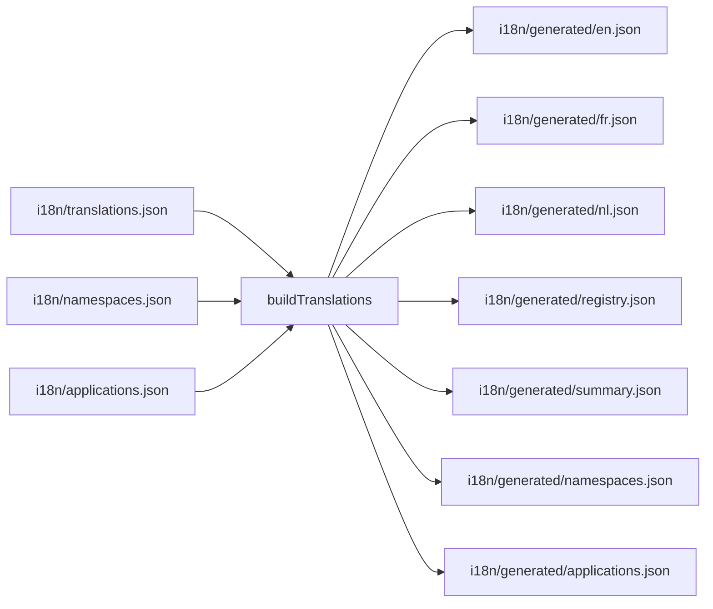
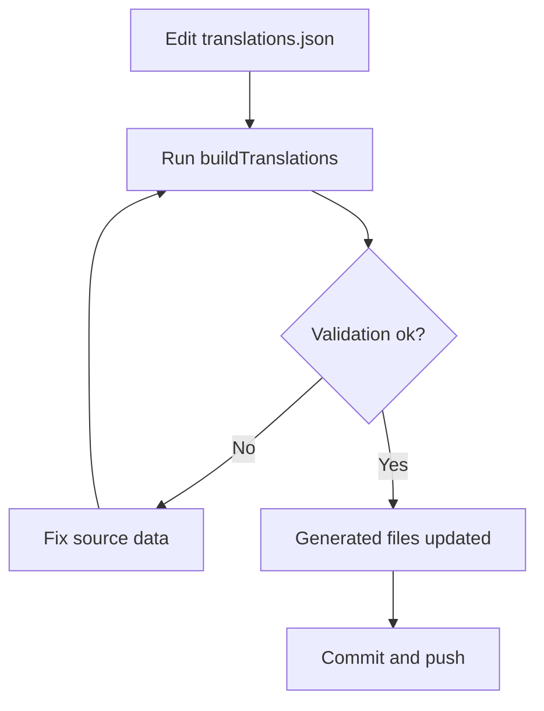
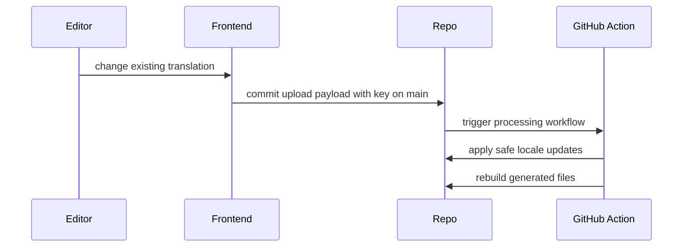
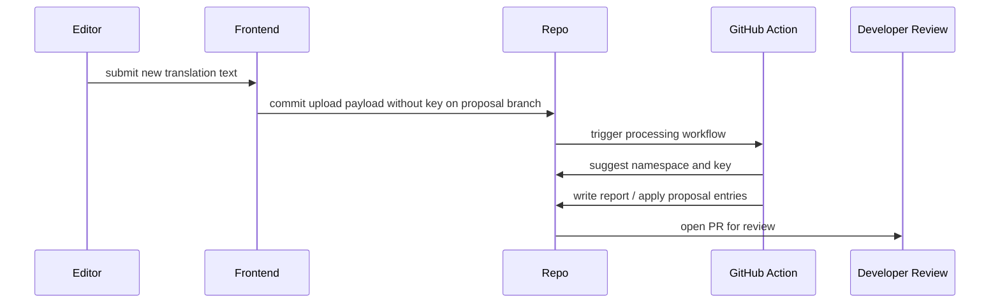

# MyPRAxIS Translation Keys

Central translation source, validation layer, and upload pipeline for MyPRAxIS.

This repository keeps one editable source of truth and derives the rest from it:

- runtime locale files
- namespace governance
- application metadata
- upload processing reports
- CI validation outputs

## Why This Repo Exists

Without structure, translations drift fast:

- duplicate keys appear
- namespaces become inconsistent
- applications lose track of what uses a key
- editors start inventing keys
- generated locale files stop matching source data

This repo prevents that by separating responsibilities:

- developers own keys, namespaces, and application mapping
- editors only submit translation content
- generated files are rebuilt from one central source

## System Overview



## Quick Start

### Main commands

| Command | Purpose |
| --- | --- |
| `npm run build:translations` | Validate source files and regenerate `i18n/generated/*` |
| `npm run check:translations` | Fail if generated files are out of sync |
| `npm run validate:translations` | Fail on warnings and errors |
| `npm run report:translations` | Print a compact health report |
| `npm run namespaces:translations` | Print configured namespaces |
| `npm run prepare:upload -- --input ./upload.json --report ./upload.report.json` | Classify one upload file |
| `npm run apply:proposals -- --input ./upload.report.json` | Accept proposal entries from a report |
| `npm run process:upload-inbox -- --mode direct` | Process incoming direct-update uploads |
| `npm run process:upload-inbox -- --mode proposal` | Process incoming proposal uploads |

### Standard developer flow

```bash
npm run build:translations
npm run check:translations
```

## Source Of Truth

The primary editable file is [`i18n/translations.json`](i18n/translations.json).

Every translation entry must contain:

- `key`
- `nl`
- `fr`
- `en`
- `applications`

Optional fields:

- `description`
- `notes`
- `deprecated`

Example:

```json
{
  "key": "common.save",
  "nl": "Opslaan",
  "fr": "Enregistrer",
  "en": "Save",
  "applications": ["mypraxis_web"]
}
```

## Repository Map

```text
i18n/
├── translations.json          # source of truth
├── namespaces.json            # allowed namespaces + default namespace
├── applications.json          # allowed application ids
├── generated/                 # generated runtime and metadata files
├── uploads/
│   ├── incoming/              # frontend-uploaded payloads waiting to be processed
│   └── processed/             # archived payloads after processing
├── upload-reports/            # JSON reports created by upload processing
├── lib/
│   ├── shared/                # paths, json io, config loading, common helpers
│   ├── build/                 # build, reporting, validation, artifact generation
│   └── upload/                # upload parsing, suggestion logic, inbox flow
├── buildTranslations.js       # build CLI entry point
├── processUpload.js           # single upload CLI entry point
└── processUploadInbox.js      # batch inbox CLI entry point
```

Internal module map:

- [`i18n/lib/README.md`](i18n/lib/README.md)
- [`i18n/lib/shared`](i18n/lib/shared)
- [`i18n/lib/build`](i18n/lib/build)
- [`i18n/lib/upload`](i18n/lib/upload)

## Build Pipeline

The translation build reads:

- [`i18n/translations.json`](i18n/translations.json)
- [`i18n/namespaces.json`](i18n/namespaces.json)
- [`i18n/applications.json`](i18n/applications.json)

Then it validates the source and writes:

- [`i18n/generated/en.json`](i18n/generated/en.json)
- [`i18n/generated/fr.json`](i18n/generated/fr.json)
- [`i18n/generated/nl.json`](i18n/generated/nl.json)
- [`i18n/generated/keys.json`](i18n/generated/keys.json)
- [`i18n/generated/namespaces.json`](i18n/generated/namespaces.json)
- [`i18n/generated/applications.json`](i18n/generated/applications.json)
- [`i18n/generated/registry.json`](i18n/generated/registry.json)
- [`i18n/generated/summary.json`](i18n/generated/summary.json)

### Generated output roles

| File | Role |
| --- | --- |
| `en.json`, `fr.json`, `nl.json` | Runtime locale trees |
| `keys.json` | Flat key list |
| `namespaces.json` | Namespace metadata + key counts |
| `applications.json` | Application metadata for frontend mapping |
| `registry.json` | Per-key registry with applications, duplicates, missing locales, and resolved values |
| `summary.json` | Compact build summary for CI and diagnostics |

## Translation Lifecycle



## Editor Upload Lifecycle

### Existing key update

Use this when the key already exists.



Rules:

- payload must include a valid existing `key`
- only `nl`, `fr`, and `en` may change
- this path may go directly to `main`

Example:

```json
{
  "entries": [
    {
      "key": "common.save",
      "fr": "Enregistrer"
    }
  ]
}
```

### New translation proposal

Use this when no key exists yet.



Rules:

- payload may not contain a `key`
- system suggests namespace and key
- system assigns default applications from repo config
- this path always goes through review

Example:

```json
{
  "entries": [
    {
      "nl": "Tijdelijke bellijst",
      "en": "Temporary call list"
    }
  ]
}
```

## Core Rules

| Rule | Level |
| --- | --- |
| Keys must be unique | Error |
| Unknown namespaces are not allowed | Error |
| Unknown applications are not allowed | Error |
| Every entry must define at least one application | Error |
| Generated files are never edited manually | Required practice |
| Editors do not choose keys or namespaces | Required practice |
| Existing-key updates may go directly to `main` | Workflow rule |
| New keys always go through proposal review | Workflow rule |

## Validation Rules

`buildTranslations` enforces:

| Check | Result |
| --- | --- |
| Missing or invalid keys | Error |
| Unknown namespaces | Error |
| Missing applications | Error |
| Invalid applications | Error |
| Duplicate keys | Error |
| Nested key conflicts | Error |
| Missing locale values | Warning |
| Restricted namespaces | Warning |
| Duplicate application values inside one entry | Warning |

Important behavior:

- duplicate keys fail the build
- missing locales do not block a normal build
- missing locales do block `validate`
- generated runtime locale files fall back to `en` when `nl` or `fr` is empty

## Upload Rules

`processUpload` enforces:

| Upload type | Allowed fields | Notes |
| --- | --- | --- |
| Direct update | `key`, `nl`, `fr`, `en` | `key` must already exist |
| Proposal | `nl`, `fr`, `en`, `description`, `notes` | `key` is not allowed |

Additional rules:

- proposal namespace suggestions only use namespaces that already exist
- direct updates with no actual locale changes are skipped
- proposal entries with no text are skipped

## Namespace Guide

Allowed namespaces are defined in [`i18n/namespaces.json`](i18n/namespaces.json).

| Namespace | Use for |
| --- | --- |
| `common.*` | Shared UI labels, buttons, field names, reusable text |
| `info.*` | Explanations, help text, onboarding, contextual guidance |
| `error.*` | Errors, failures, validation messages |
| `success.*` | Success and completed-state feedback |
| `authentication.*` | Identity, login, verification, token and auth copy |
| `applicationNames.*` | Product and application names |
| `metadata.*` | Page titles and meta descriptions |

If no stronger namespace fits, use `common.*`.

## Application Mapping

Allowed application ids are defined in [`i18n/applications.json`](i18n/applications.json).

These ids are validated by:

- the editor schema
- the build pipeline
- generated metadata output

Frontend consumers should read:

- [`i18n/generated/applications.json`](i18n/generated/applications.json)

## Batch Naming Convention

Use one stable batch id everywhere:

```text
YYYYMMDD-HHMMSS-<shortId>
```

Example:

```text
20260401-114343-gz8lix
```

### Frontend-created objects

| Object | Direct flow | Proposal flow |
| --- | --- | --- |
| Branch | `main` | `translation_proposals/<batchId>` |
| Upload file | `frontend_direct_batch_<batchId>.json` | `frontend_proposal_batch_<batchId>.json` |
| Commit message | `Frontend Translation Direct Batch <batchId>` | `Frontend Translation Proposal Batch <batchId>` |
| PR title | not used | `Translation Review Batch <batchId> (<count> entries)` |

Proposal PR body should include:

- batch id
- entry count
- source `frontend-editor`
- optional editor note or batch label

### Bot-created objects

| Object | Name |
| --- | --- |
| Artifact regeneration commit | `Translation Bot: Regenerate Generated Files` |
| Upload processing commit | `Translation Bot: Process Upload Batch` |

## Workflows

### Developer workflow

1. Edit [`i18n/translations.json`](i18n/translations.json).
2. Edit [`i18n/namespaces.json`](i18n/namespaces.json) only when a real new namespace is needed.
3. Keep `applications` accurate per entry.
4. Run `npm run build:translations`.
5. Review [`i18n/generated`](i18n/generated).
6. Commit and push.

This is the only workflow where keys and namespaces are changed manually.

### Editor workflow

Editors do not work directly in `translations.json`.

- existing key updates go through the direct-update flow
- new translations go through the proposal flow
- developers review namespace, key choice, and application mapping before merge

## GitHub Workflows

- [`.github/workflows/buildTranslations.yml`](.github/workflows/buildTranslations.yml)
  Validates and rebuilds translation artifacts.

- [`.github/workflows/processTranslationUploads.yml`](.github/workflows/processTranslationUploads.yml)
  Processes frontend-uploaded translation payloads.

## Notes

These files are documented in the README because JSON files cannot contain inline comments:

- [`i18n/translations.json`](i18n/translations.json)
- [`i18n/namespaces.json`](i18n/namespaces.json)
- [`i18n/applications.json`](i18n/applications.json)
- [`i18n/upload.schema.json`](i18n/upload.schema.json)
- [`i18n/translations.schema.json`](i18n/translations.schema.json)
- [`package.json`](package.json)
