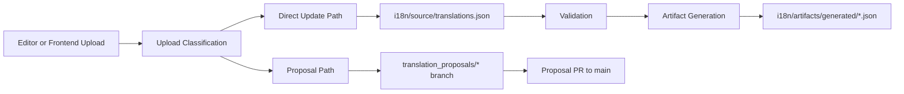
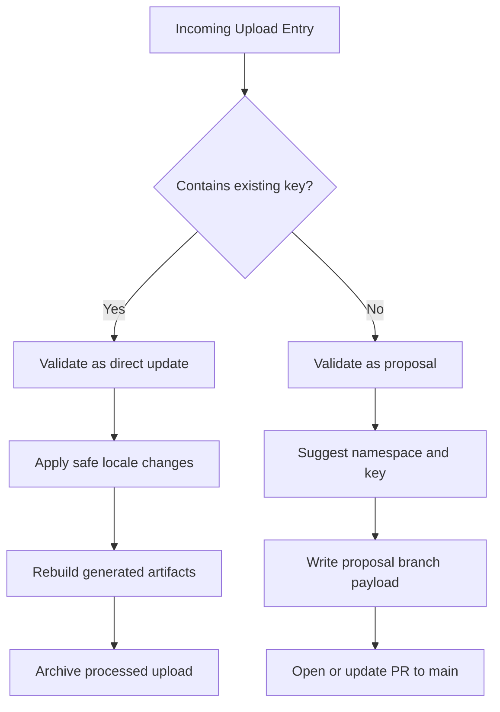
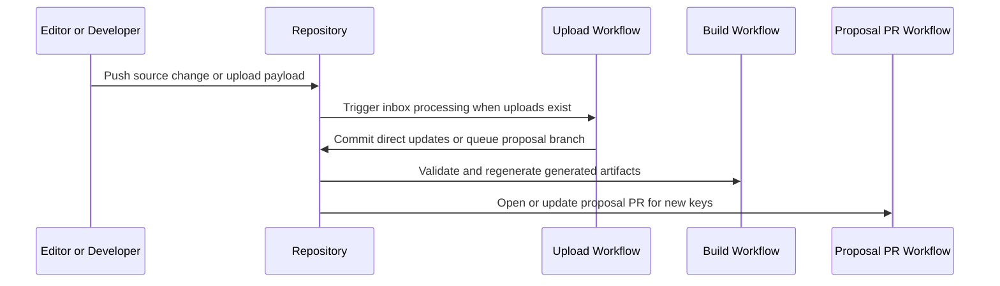

# MyPRAxIS Translation Keys

[](https://github.com/PRAxISDEVELOPMENT/mypraxis_translation_keys/actions/workflows/buildTranslations.yml)
[](https://github.com/PRAxISDEVELOPMENT/mypraxis_translation_keys/actions/workflows/processTranslationUploads.yml)
[](https://github.com/PRAxISDEVELOPMENT/mypraxis_translation_keys/actions/workflows/openTranslationProposalPr.yml)

Central repository for MyPRAxIS translation content, validation, artifact generation, upload processing, and proposal automation.

> [!IMPORTANT]
> The single source of truth is [i18n/source/translations.json](i18n/source/translations.json).  
> Files under [i18n/artifacts/generated/](i18n/artifacts/generated/) are generated output and should never be edited manually.

## Overview

This repository exists to keep translation management predictable, reviewable, and automation-friendly across MyPRAxIS applications.

It handles four responsibilities in one place:

1. Store canonical translation entries.
2. Validate keys, namespaces, applications, and locale completeness.
3. Generate runtime translation artifacts for consumers.
4. Process editor or frontend uploads for both direct updates and new-key proposals.

The core operating rule is intentionally strict:

- existing keys can be updated directly
- new keys must go through a proposal path

That split keeps editorial updates fast without letting structural key changes bypass review.

## Why This Repository Is Useful

- One canonical source file keeps translations auditable.
- Generated artifacts are reproducible and easy to verify in CI.
- Mixed upload batches are classified automatically.
- New keys get reviewable GitHub pull requests instead of silent production drift.
- Frontend and editor flows can be tested locally without hand-crafting inbox files.

## Architecture

### System Overview



### Upload Decision Flow



### GitHub Automation Flow



## Operating Model

### Direct Update Path

Use this when an upload includes a known translation `key`.

- the upload is classified as a direct update
- only safe locale changes are applied
- source data is updated on `main`
- generated artifacts are rebuilt
- processed payloads are archived

### Proposal Path

Use this when an upload does not include a `key`.

- the upload is classified as a proposal
- a namespace and key suggestion are generated
- the proposal is processed on a `translation_proposals/*` branch
- GitHub opens or updates a PR to `main`

### Mixed Batches

If a single upload file contains both existing-key edits and new entries, the router splits that file automatically into direct and proposal subsets.

## Repository Structure

```text
i18n/
├── artifacts/
│   ├── generated/            # generated runtime and metadata files
│   └── reports/              # upload and routing reports
├── bin/                      # CLI entry points
├── config/                   # namespaces, applications, and schemas
├── source/                   # canonical translation source
├── src/
│   ├── core/                 # shared helpers and IO
│   ├── translation-build/    # validation and artifact generation
│   └── upload-processing/    # upload classification, routing, and proposals
└── uploads/
    ├── incoming/             # queued upload payloads
    └── processed/            # archived processed payloads

.github/
├── pull_request_template.md
└── workflows/
    ├── buildTranslations.yml
    ├── openTranslationProposalPr.yml
    └── processTranslationUploads.yml

scripts/
├── check-node-syntax.sh
└── update-translations.sh
```

## Key Files

| File | Purpose |
| --- | --- |
| [i18n/source/translations.json](i18n/source/translations.json) | Canonical translation entries |
| [i18n/config/namespaces.json](i18n/config/namespaces.json) | Allowed namespaces and default namespace |
| [i18n/config/applications.json](i18n/config/applications.json) | Allowed application identifiers |
| [i18n/config/upload.schema.json](i18n/config/upload.schema.json) | Upload payload shape for editor and frontend integrations |
| [i18n/bin/build-translations.js](i18n/bin/build-translations.js) | Validation and artifact generation CLI |
| [i18n/bin/process-upload.js](i18n/bin/process-upload.js) | Single upload prepare and proposal-apply CLI |
| [i18n/bin/process-upload-inbox.js](i18n/bin/process-upload-inbox.js) | Batch inbox processor |
| [i18n/bin/route-upload-batches.js](i18n/bin/route-upload-batches.js) | Mixed-batch router |
| [i18n/bin/simulate-upload.js](i18n/bin/simulate-upload.js) | Local helper for app-style upload simulation |

## Quick Start

### Install

```bash
npm install
npm run tooling:check-syntax
```

### Validate and Build

```bash
npm run translations:build
npm run translations:check
```

### Inspect Detailed Health

```bash
npm run translations:report
```

## Upload Processing

### Upload Payload Shape

```json
{
  "version": 1,
  "source": "frontend-editor",
  "entries": [
    {
      "key": "common.save",
      "nl": "Opslaan"
    },
    {
      "nl": "Nieuwe knop",
      "fr": "Nouveau bouton",
      "en": "New button",
      "description": "New scheduling CTA"
    }
  ]
}
```

Rules:

- include `key` only for existing translation keys
- omit `key` for new translation proposals
- supported locales are `nl`, `fr`, and `en`
- proposal entries may include `description` and `notes`

### Single Upload Analysis

```bash
npm run uploads:prepare -- --input path/to/upload.json
```

### Mixed Batch Routing

```bash
npm run uploads:route
```

### Inbox Processing

```bash
npm run uploads:process-inbox -- --mode direct
npm run uploads:process-inbox -- --mode proposal
```

## Frontend And Editor Testing

Use the simulate helper when you want to test the same upload classification and inbox flow locally without manually placing JSON files in `i18n/uploads/incoming`.

### Simulate An Existing Key Update

```bash
npm run uploads:simulate -- edit --key common.save --fr "Enregistrer depuis l'app"
```

### Simulate A New Translation Proposal

```bash
npm run uploads:simulate -- new --nl "Nieuwe knop" --fr "Nouveau bouton" --en "New button"
```

Both commands default to `dry run`.

Use `--apply` if you want to update local source data and regenerate artifacts:

```bash
npm run uploads:simulate -- edit --key common.save --fr "Enregistrer depuis l'app" --apply
npm run uploads:simulate -- new --nl "Nieuwe knop" --fr "Nouveau bouton" --en "New button" --apply
```

## Automation

This repository uses three GitHub Actions workflows:

- [.github/workflows/buildTranslations.yml](.github/workflows/buildTranslations.yml)  
  Validates translation changes and regenerates generated artifacts on `main`.
- [.github/workflows/processTranslationUploads.yml](.github/workflows/processTranslationUploads.yml)  
  Routes and processes incoming upload batches.
- [.github/workflows/openTranslationProposalPr.yml](.github/workflows/openTranslationProposalPr.yml)  
  Opens or updates proposal pull requests for new keys.

### Proposal PR Behavior

Proposal pull requests are structured for review:

- they target `main`
- labels are applied automatically
- reviewer routing can be configured through repository variables
- proposal report files are summarized in the PR body

Repository variables used by proposal automation:

- `TRANSLATION_PROPOSAL_REVIEWERS`
- `TRANSLATION_PROPOSAL_TEAM_REVIEWERS`
- `TRANSLATION_PROPOSAL_ASSIGNEES`

## Command Reference

| Command | Purpose |
| --- | --- |
| `npm run help` | Print the main translation help output |
| `npm run tooling:check-syntax` | Syntax-check all Node CLI and implementation files |
| `npm run translations:build` | Validate source and regenerate derived files |
| `npm run translations:check` | Verify generated artifacts are in sync |
| `npm run translations:validate` | Fail on warnings or errors |
| `npm run translations:report` | Print a full validation report |
| `npm run translations:list-namespaces` | List configured namespaces |
| `npm run uploads:help` | Print help for single-upload processing |
| `npm run uploads:prepare -- --input <file>` | Analyze one upload payload |
| `npm run uploads:apply-proposals -- --input <report-file>` | Apply proposals from a report |
| `npm run uploads:process-inbox:help` | Print help for inbox processing |
| `npm run uploads:process-inbox -- --mode direct` | Process direct-update batches |
| `npm run uploads:process-inbox -- --mode proposal` | Process proposal batches |
| `npm run uploads:route` | Split mixed upload files into direct and proposal batches |
| `npm run uploads:route:help` | Print help for upload routing |
| `npm run uploads:simulate -- edit ...` | Simulate an existing-key app upload |
| `npm run uploads:simulate -- new ...` | Simulate a new-key app upload |
| `npm run uploads:simulate:help` | Print help for upload simulation |
| `npm run update` | Build, commit, push, and sync the current branch |

## Operational Rules

- Never edit files under `i18n/artifacts/generated/` manually.
- Keep [i18n/source/translations.json](i18n/source/translations.json) as the canonical source.
- Direct updates must use existing keys only.
- New keys must enter through the proposal path.
- Every entry must use an allowed namespace.
- Every entry must include at least one allowed application.

## Getting Help

- For repository-level work, open an issue in this repository.
- For translation proposal review, use the generated pull request discussion.
- For local workflow questions, start with `npm run help` and the command-specific `:help` scripts.

## Maintainers

Maintained by [PRAxISDEVELOPMENT](https://github.com/PRAxISDEVELOPMENT).

## Summary

If you remember only the model:

- source lives in `i18n/source/`
- rules live in `i18n/config/`
- logic lives in `i18n/src/`
- entry points live in `i18n/bin/`
- runtime output lives in `i18n/artifacts/generated/`
- upload state lives in `i18n/uploads/`

That separation is what keeps the system predictable, reviewable, and automatable.
