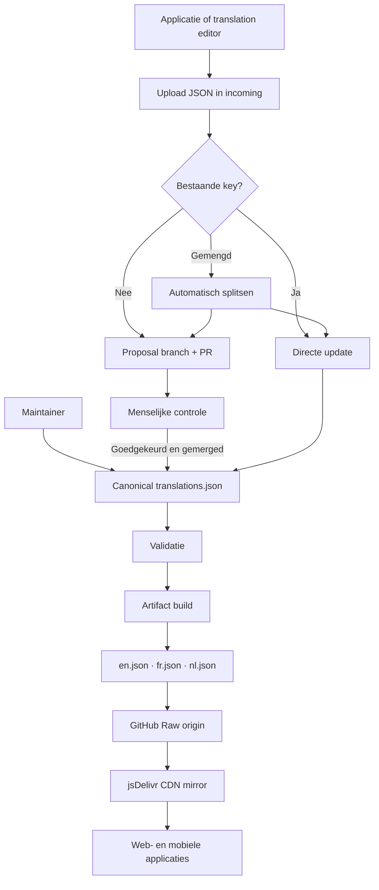
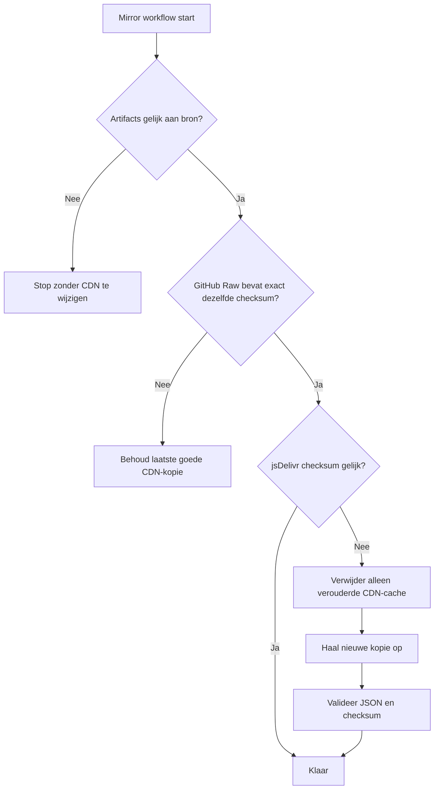

# MyPRAxIS Translation Platform

[](https://github.com/PRAxISDEVELOPMENT/mypraxis_translation_keys/actions/workflows/buildTranslations.yml)
[](https://github.com/PRAxISDEVELOPMENT/mypraxis_translation_keys/actions/workflows/processTranslationUploads.yml)
[](https://github.com/PRAxISDEVELOPMENT/mypraxis_translation_keys/actions/workflows/openTranslationProposalPr.yml)
[](https://github.com/PRAxISDEVELOPMENT/mypraxis_translation_keys/actions/workflows/publishTranslationMirror.yml)

Eén centrale, gecontroleerde bron voor alle Nederlandse, Franse en Engelse
MyPRAxIS-vertalingen — van wijziging en review tot runtime-publicatie voor web
en mobiele applicaties.

> [!IMPORTANT]
> [i18n/source/translations.json](i18n/source/translations.json) is altijd de
> enige bron van waarheid. Bestanden in
> [i18n/artifacts/generated/](i18n/artifacts/generated/) worden automatisch
> gegenereerd en mogen nooit handmatig worden aangepast.

## In één minuut

| Onderdeel | Antwoord |
| --- | --- |
| Ondersteunde talen | Nederlands (`nl`), Frans (`fr`) en Engels (`en`) |
| Centrale bron | [i18n/source/translations.json](i18n/source/translations.json) |
| Runtime-bestanden | `nl.json`, `fr.json` en `en.json` |
| Primaire runtime-host | jsDelivr CDN |
| Originele host | GitHub Raw |
| Bestaande key wijzigen | Automatisch verwerkt |
| Nieuwe key toevoegen | Altijd via een handmatig gecontroleerde proposal-PR |
| Normale lokale opdracht | `npm run update` |
| Gegenereerde bestanden bewerken | Nooit |

De belangrijkste regel:

```text
Bestaande key  → automatische update
Nieuwe key     → voorstel → menselijke controle → merge → publicatie
```

## Snel naar de juiste taak

| Ik wil... | Ga naar... |
| --- | --- |
| een bestaande vertaling aanpassen | [Bestaande key wijzigen](#route-a-bestaande-key-wijzigen-vanuit-een-applicatie) |
| een nieuwe vertaling/key toevoegen | [Nieuwe key toevoegen](#route-b-nieuwe-key-toevoegen-vanuit-een-applicatie) |
| rechtstreeks in deze repository werken | [Handmatig onderhouden](#route-d-handmatig-onderhouden-in-deze-repository) |
| een applicatie naar de CDN migreren | [Applicaties aanpassen](#wat-moet-in-de-applicaties-worden-aangepast) |
| begrijpen wat GitHub Actions doet | [Automatisering](#github-actions-en-verantwoordelijkheden) |
| een probleem onderzoeken | [Troubleshooting](#troubleshooting) |
| alle commando's bekijken | [Commandoreferentie](#commandoreferentie) |
| dieper in de techniek duiken | [Verdiepende documentatie](#verdiepende-documentatie) |

## Het volledige systeem



Dit ontwerp combineert twee doelen:

- wijzigingen aan bestaande teksten moeten snel en automatisch kunnen landen
- nieuwe keys, namespaces en toepassingsscope moeten eerst door een mens worden
  gecontroleerd

## Welke route wordt wanneer gebruikt?

| Situatie | Automatisch? | Menselijke review? | Resultaat |
| --- | --- | --- | --- |
| Applicatie wijzigt bestaande key | Ja | Nee | Bron en runtime-JSON worden bijgewerkt |
| Applicatie stelt nieuwe key voor | Gedeeltelijk | Ja | Proposal-PR wordt geopend |
| Upload bevat bestaand én nieuw | Ja | Alleen nieuwe entries | Batch wordt automatisch gesplitst |
| Maintainer wijzigt bronbestand | Build en publicatie | Normale code-review indien van toepassing | Nieuwe runtime-artifacts |
| Alleen reviewstatus verandert | Ja | Volgens teamproces | Registry/status wordt opnieuw opgebouwd |
| Generated bestand wordt handmatig gewijzigd | Geblokkeerd door sync-check | Niet toegestaan | Build moet het bestand herstellen |

## Route A: bestaande key wijzigen vanuit een applicatie

Een upload-entry met een bestaande `key` is een directe update.

```json
{
  "version": 1,
  "source": "mypraxis-web-editor",
  "entries": [
    {
      "key": "common.save",
      "nl": "Opslaan",
      "fr": "Enregistrer",
      "en": "Save"
    }
  ]
}
```

De automatische flow:

1. De applicatie commit het uploadbestand in `i18n/uploads/incoming/` op `main`.
2. GitHub Actions herkent dat `common.save` al bestaat.
3. Alleen werkelijk gewijzigde locale-waarden worden toegepast.
4. `translations.json` wordt bijgewerkt.
5. `en.json`, `fr.json` en `nl.json` worden opnieuw gegenereerd.
6. De resultaten worden naar `main` gepusht.
7. De CDN-mirror wordt onmiddellijk gecontroleerd en indien nodig vernieuwd.

> [!NOTE]
> Een expliciete lege string wist alleen die locale. Een ontbrekend veld laat
> de bestaande waarde ongemoeid.

Voorbeeld: alleen de Franse tekst wissen:

```json
{
  "key": "common.save",
  "fr": ""
}
```

## Route B: nieuwe key toevoegen vanuit een applicatie

Een upload-entry zonder `key` is altijd een voorstel voor een nieuwe key.

```json
{
  "version": 1,
  "source": "mypraxis-app-editor",
  "entries": [
    {
      "nl": "Nieuwe afspraak maken",
      "fr": "Créer un nouveau rendez-vous",
      "en": "Create a new appointment",
      "description": "Primaire knop op het afsprakenoverzicht",
      "requestedNamespace": "common"
    }
  ]
}
```

De gecontroleerde flow:

1. De upload wordt herkend als nieuwe-keyvoorstel.
2. Het systeem stelt een key en namespace voor.
3. Er wordt een `translation_proposals/**` branch gemaakt.
4. GitHub opent automatisch een proposal-PR.
5. Een medewerker controleert minimaal:

   - de voorgestelde key
   - de namespace
   - `nl`, `fr` en `en`
   - de applicatiescope
   - beschrijving en notities
6. De proposal-JSON mag in de PR worden verbeterd.
7. Na goedkeuring wordt de PR gemerged.
8. De build verwerkt het goedgekeurde voorstel in `translations.json`.
9. De runtime-JSON en CDN-mirror worden automatisch vernieuwd.

> [!CAUTION]
> Voeg een nieuwe key nooit rechtstreeks vanuit een applicatie toe aan
> `translations.json`. De proposal-PR is de verplichte kwaliteitscontrole.

## Route C: gemengde upload

Eén upload mag bestaande én nieuwe entries bevatten. De router splitst die
automatisch:

```text
Gemengde upload
├── entries met bestaande key → direct verwerken
└── entries zonder key        → proposal-PR
```

De bestaande wijzigingen hoeven dus niet te wachten op de review van nieuwe
keys.

## Route D: handmatig onderhouden in deze repository

Gebruik deze route wanneer een maintainer bewust rechtstreeks de centrale bron
wijzigt.

### Eerste installatie

Vereisten:

- Node.js 20 of nieuwer
- npm
- Git
- optioneel: GitHub CLI (`gh`) om workflowruns automatisch te volgen

```bash
npm install
```

### Aanbevolen dagelijkse flow

```bash
npm run update
```

Deze helper:

1. bouwt de vertalingen lokaal
2. vraagt om een commitbericht
3. staget en commit de wijzigingen
4. pusht de huidige branch
5. wacht op de relevante GitHub Action wanneer `gh` beschikbaar is
6. synchroniseert de lokale branch opnieuw

### Handmatige variant

```bash
npm run translations:build
npm run translations:check
```

Controleer daarna altijd zowel de bronwijziging als de gegenereerde diff.

## Wat moet in de applicaties worden aangepast?

Alle applicaties die nu rechtstreeks van GitHub Raw laden, moeten overschakelen
naar de jsDelivr-URL.

### Oude URL

```text
https://raw.githubusercontent.com/PRAxISDEVELOPMENT/mypraxis_translation_keys/main/i18n/artifacts/generated/{{lng}}.json
```

### Nieuwe primaire URL

```text
https://cdn.jsdelivr.net/gh/PRAxISDEVELOPMENT/mypraxis_translation_keys@main/i18n/artifacts/generated/{{lng}}.json
```

Voorbeelden:

```text
https://cdn.jsdelivr.net/gh/PRAxISDEVELOPMENT/mypraxis_translation_keys@main/i18n/artifacts/generated/nl.json
https://cdn.jsdelivr.net/gh/PRAxISDEVELOPMENT/mypraxis_translation_keys@main/i18n/artifacts/generated/fr.json
https://cdn.jsdelivr.net/gh/PRAxISDEVELOPMENT/mypraxis_translation_keys@main/i18n/artifacts/generated/en.json
```

Kopieer indien gewenst een bestaand voorbeeld:

| Platform | JavaScript | TypeScript |
| --- | --- | --- |
| React web | [template](templates/javascript/web/i18n.js) | [template](templates/typescript/web/i18n.ts) |
| Expo / React Native | [template](templates/javascript/expo/i18n.js) | [template](templates/typescript/expo/i18n.ts) |

> [!WARNING]
> De templates gebruiken jsDelivr als primaire bron, maar implementeren nog
> geen automatische netwerkfallback of persistente lokale cache. Voor maximale
> beschikbaarheid hoort iedere productieapp de laatst succesvolle response
> lokaal te bewaren. GitHub Raw kan daarnaast als secundair endpoint dienen.

Aanbevolen runtimevolgorde voor productieapplicaties:

```text
1. jsDelivr CDN
2. GitHub Raw wanneer een expliciete endpoint-fallback is geïmplementeerd
3. laatst succesvol lokaal gecachte vertaling
4. meegeleverde basisvertaling voor een eerste offline start
```

Taalfallback en netwerkfallback zijn niet hetzelfde:

- `fallbackLng: false` maakt ontbrekende keys zichtbaar tijdens ontwikkeling
- endpoint/cache-fallback houdt vertalingen beschikbaar tijdens een storing

## CDN-publicatie en beschikbaarheid

jsDelivr is een publieke CDN-mirror voor bestanden uit deze openbare
GitHub-repository. Er is geen jsDelivr-account, API-token, repository secret of
betaalmethode nodig.

### Wanneer wordt de mirror vernieuwd?

| Trigger | Doel |
| --- | --- |
| Wijziging aan `en.json`, `fr.json` of `nl.json` op `main` | Onmiddellijk publiceren |
| Iedere zes uur, op minuut 23 UTC | Gemiste of mislukte refresh herstellen |
| Handmatige GitHub Actions-run | Onderhoud of diagnose |

De zesuurs-run is dus geen publicatievertraging. Een normale wijziging activeert
de mirror onmiddellijk.

### Veilige refreshvolgorde



De controles lopen voor `en`, `fr` en `nl` onafhankelijk. Een probleem met één
taal verhindert niet dat de andere talen worden gecontroleerd.

### Wat gebeurt bij een storing?

| Storing | Gedrag |
| --- | --- |
| GitHub Raw tijdelijk offline | De bestaande jsDelivr-kopie wordt niet verwijderd |
| GitHub Actions tijdelijk offline | De laatst gepubliceerde CDN-kopie blijft staan |
| jsDelivr tijdelijk offline | GitHub Raw blijft beschikbaar als secundaire bron, mits de app die fallback implementeert |
| Beide endpoints offline | Alleen lokale/app-bundled fallback kan de UI beschikbaar houden |

## Datamodel

Een canonical translation-entry ziet er zo uit:

```json
{
  "key": "common.save",
  "nl": "Opslaan",
  "fr": "Enregistrer",
  "en": "Save",
  "applications": ["mypraxis_web", "mypraxis_app"],
  "status": {
    "fr": "review-required"
  }
}
```

| Veld | Betekenis |
| --- | --- |
| `key` | Unieke dot-notation key, bijvoorbeeld `common.save` |
| `nl`, `fr`, `en` | Tekst per taal |
| `applications` | Applicaties waarin de key wordt gebruikt |
| `status` | Optionele reviewstatus per locale |

Toegestane reviewstatussen:

- `approved`
- `review-required`

Als een locale niet in `status` staat, geldt standaard `approved`.

Toegestane applicatiescopes:

- `mypraxis_app`
- `mypraxis_web`
- `documenten`
- `mypraxis_data`

De standaardnamespace is `common`. De volledige actieve lijst is:
`applicationNames`, `authentication`, `common`, `confirmation`, `error`,
`info`, `metadata`, `notification`, `status`, `success` en `warning`. Beheer
deze lijsten uitsluitend via [i18n/config/](i18n/config/).

## Gegenereerde artifacts

De build produceert runtime- en metadatafiles in
[i18n/artifacts/generated/](i18n/artifacts/generated/).

| Bestand | Gebruik |
| --- | --- |
| `nl.json` | Nederlandse runtimevertalingen |
| `fr.json` | Franse runtimevertalingen |
| `en.json` | Engelse runtimevertalingen |
| `registry.json` | Volledige registry met reviewmetadata |
| `summary.json` | Gezondheids- en tellingsoverzicht |
| `keys.json` | Overzicht van alle keys |
| `namespaces.json` | Gegenereerde namespace-informatie |
| `applications.json` | Gegenereerde applicatie-informatie |

Runtime locale-files bevatten alleen de vertaalboom. Reviewstatussen worden niet
in de zichtbare vertaalwaarde gemengd; daarvoor dient `registry.json`.

## Repositorystructuur

```text
.
├── .github/workflows/              # GitHub Actions
├── docs/                           # verdiepende handleidingen
├── i18n/
│   ├── artifacts/
│   │   ├── generated/              # automatisch gegenereerde runtime-output
│   │   └── reports/                # analyse- en verwerkingsrapporten
│   ├── bin/                        # CLI-entrypoints
│   ├── config/                     # schemas, namespaces en applicaties
│   ├── proposals/
│   │   ├── pending/                # te reviewen proposal-objecten
│   │   └── processed/              # toegepaste proposal-objecten
│   ├── source/
│   │   └── translations.json       # enige bron van waarheid
│   ├── src/
│   │   ├── core/                   # gedeelde hulpmiddelen
│   │   ├── translation-build/      # validatie en artifactgeneratie
│   │   └── upload-processing/      # routing, direct updates en proposals
│   └── uploads/
│       ├── incoming/               # nieuwe uploadqueue
│       └── processed/              # verwerkte uploadarchive
├── scripts/                        # lokale helpers en mirrorcontrole
└── templates/                      # web- en Expo-integratievoorbeelden
```

## Belangrijkste bestanden

| Bestand of map | Verantwoordelijkheid |
| --- | --- |
| [i18n/source/translations.json](i18n/source/translations.json) | Canonical vertalingen |
| [i18n/config/translations.schema.json](i18n/config/translations.schema.json) | Contract van de centrale bron |
| [i18n/config/upload.schema.json](i18n/config/upload.schema.json) | Contract van applicatie-uploads |
| [i18n/config/namespaces.json](i18n/config/namespaces.json) | Toegestane namespaces |
| [i18n/config/applications.json](i18n/config/applications.json) | Bekende applicaties |
| [i18n/bin/build-translations.js](i18n/bin/build-translations.js) | Build- en validatie-entrypoint |
| [i18n/src/translation-build/](i18n/src/translation-build/) | Implementatie van validatie/generatie |
| [i18n/src/upload-processing/](i18n/src/upload-processing/) | Implementatie van uploadrouting |
| [scripts/sync-translation-mirror.js](scripts/sync-translation-mirror.js) | Veilige GitHub/jsDelivr-synccontrole |
| [templates/](templates/) | Copy-ready clientconfiguraties |

## GitHub Actions en verantwoordelijkheden

| Workflow | Start wanneer | Verantwoordelijkheid |
| --- | --- | --- |
| [Validate And Build](.github/workflows/buildTranslations.yml) | PR of relevante push naar `main` | Bron valideren, proposals toepassen en artifacts bouwen |
| [Process Uploads](.github/workflows/processTranslationUploads.yml) | Upload in `incoming/` | Directe updates verwerken en nieuwe entries routeren |
| [Open Proposal PR](.github/workflows/openTranslationProposalPr.yml) | Proposal-branch verandert | Reviewbare PR openen of bijwerken |
| [Publish CDN Mirror](.github/workflows/publishTranslationMirror.yml) | Locale-artifact verandert, planning of handmatig | jsDelivr controleren en veilig vernieuwen |

Branchmodel:

```text
main                         → canonical integratie en directe updates
translation_proposals/**     → tijdelijke reviewbranches voor nieuwe keys
```

## Commandoreferentie

### Normale opdrachten

| Command | Doel |
| --- | --- |
| `npm install` | Projectafhankelijkheden installeren |
| `npm run update` | Bouwen, committen, pushen, workflow volgen en synchroniseren |
| `npm run tooling:check-syntax` | Syntax van alle Node-tooling controleren |
| `npm run translations:build` | Bron valideren en artifacts opnieuw genereren |
| `npm run translations:check` | Controleren of artifacts met de bron overeenkomen |
| `npm run translations:validate` | Strikte validatie; warnings laten de opdracht falen |
| `npm run translations:report` | Uitgebreid gezondheidsrapport tonen |
| `npm run translations:list-namespaces` | Beschikbare namespaces tonen |
| `npm run translations:help` | Alle translation-buildopties tonen |
| `npm run help` | Verkorte alias voor de buildhelp |

### Upload- en diagnoseopdrachten

| Command | Doel |
| --- | --- |
| `npm run uploads:prepare -- --input <file>` | Upload analyseren zonder automatisch alles toe te passen |
| `npm run uploads:prepare -- --input <file> --apply-direct` | Geldige bestaande-keyupdates toepassen |
| `npm run uploads:route` | Gemengde batches splitsen |
| `npm run uploads:process-inbox -- --mode direct` | Direct-updatequeue verwerken |
| `npm run uploads:process-inbox -- --mode proposal` | Proposal-objecten genereren |
| `npm run uploads:apply-proposals -- --input <report>` | Proposals uit één preparerapport toepassen |
| `npm run proposals:apply-pending` | Goedgekeurde proposal-objecten toepassen |
| `npm run uploads:simulate -- ...` | Uploadgedrag lokaal simuleren |
| `npm run uploads:help` | Upload-CLI-help tonen |
| `npm run uploads:route:help` | Routeropties tonen |
| `npm run uploads:process-inbox:help` | Inboxprocessoropties tonen |
| `npm run uploads:simulate:help` | Simulatieopties tonen |

Voorbeelden:

```bash
# Bestaande key simuleren
npm run uploads:simulate -- edit --key common.save --fr "Enregistrer"

# Nieuwe key simuleren
npm run uploads:simulate -- new --nl "Nieuwe knop" --fr "Nouveau bouton" --en "New button"

# Nieuwe key met gewenste namespace simuleren
npm run uploads:simulate -- new --nl "Nieuwe uitleg" --requested-namespace info
```

Simulaties zijn standaard dry runs. Gebruik alleen bewust `--apply` wanneer het
resultaat lokaal moet worden geschreven.

## Reviewchecklist voor nieuwe keys

Controleer voor het mergen van een proposal-PR:

- [ ] De key is duidelijk, stabiel en correct gespeld.
- [ ] De namespace past bij de functie van de tekst.
- [ ] Nederlands, Frans en Engels zijn inhoudelijk gelijkwaardig.
- [ ] Variabelen/placeholders zijn in alle talen behouden.
- [ ] HTML of formattering is alleen aanwezig wanneer dat bewust nodig is.
- [ ] De applicatiescope is correct.
- [ ] Beschrijving en notities geven voldoende context.
- [ ] Alle verplichte GitHub Actions zijn groen.
- [ ] De diff bevat geen handmatige wijzigingen aan generated artifacts.

## Troubleshooting

| Probleem | Waarschijnlijke oorzaak | Wat controleren? |
| --- | --- | --- |
| Upload verandert niets | Waarden zijn identiek of entry is overgeslagen | `i18n/artifacts/reports/` |
| Nieuwe key staat niet in `translations.json` | Wacht nog op proposal-review | `i18n/proposals/pending/` en open PR's |
| Generated files zijn out of sync | Bron/config veranderde zonder build | `npm run translations:build` en daarna `translations:check` |
| CDN-workflow faalt vóór purge | GitHub Raw heeft de nieuwe checksum nog niet | Run later opnieuw; oude CDN-kopie blijft behouden |
| Eén taal loopt achter | Alleen dat locale-artifact of CDN-object faalde | Logregels met `en.json`, `fr.json` of `nl.json` |
| App toont oude tekst | App/browsercache of app gebruikt nog GitHub Raw | Controleer loadPath, netwerkrequest en lokale cache |
| App toont missing key | Key/locale ontbreekt of verkeerde namespace | Generated locale-file en gebruikte i18n-key |
| Proposal-PR verschijnt niet | Proposal branch/workflow of payload ongeldig | Actions-run en routingrapport |

Onderzoek een uploadprobleem altijd in deze volgorde:

1. [i18n/artifacts/reports/](i18n/artifacts/reports/)
2. [i18n/uploads/incoming/](i18n/uploads/incoming/) of
   [i18n/uploads/processed/](i18n/uploads/processed/)
3. [i18n/proposals/pending/](i18n/proposals/pending/) voor nieuwe keys
4. de relevante run onder de GitHub Actions-tab

## Niet doen

- Bewerk nooit `i18n/artifacts/generated/*.json` met de hand.
- Omzeil nooit de proposal-route voor een nieuwe key.
- Commit nooit tokens, wachtwoorden of andere secrets.
- Behandel `uploads/` niet als canonical businessdata; het is workflowstatus.
- Verander schemas, namespaces of applicatiescope niet zonder de impact te
  controleren.
- Verwijder geen rapporten of proposal-objecten om een fout te verbergen.

## Verdiepende documentatie

| Document | Onderwerp |
| --- | --- |
| [CONTRIBUTING.md](CONTRIBUTING.md) | Bijdragen, werkregels en PR-verwachtingen |
| [docs/README.md](docs/README.md) | Volledige documentatie-index |
| [docs/architecture.md](docs/architecture.md) | Architectuur en verantwoordelijkheidsgrenzen |
| [docs/upload-processing.md](docs/upload-processing.md) | Uploads, routing, direct updates en proposals |
| [docs/github-automation.md](docs/github-automation.md) | Alle GitHub Actions en branches |
| [docs/maintainer-workflow.md](docs/maintainer-workflow.md) | Dagelijkse maintainerflow |
| [templates/README.md](templates/README.md) | Web- en Expo-clientintegratie |

## Waarom deze distributieaanpak?

De relevante opties zijn afgewogen:

| Optie | Voordeel | Waarom niet als hoofdoplossing? |
| --- | --- | --- |
| Alleen GitHub Raw | Zeer eenvoudig | GitHub wordt een single point of failure |
| Vertalingen alleen in app bundelen | Volledig offline | Nieuwe teksten vereisen een app-release |
| Eigen FTP/SFTP-server | Volledige controle | Serverbeheer, monitoring, HTTPS en beschikbaarheid nodig |
| Betaalde object storage/CDN | Professionele controle en SLA-opties | Account, configuratie en betaalgegevens nodig |
| GitHub Pages | Eenvoudig binnen GitHub | Blijft afhankelijk van hetzelfde platform |
| jsDelivr + GitHub + app-cache | Live, gratis, weinig beheer en meerdere lagen | App-cache/fallback moet per applicatie worden afgewerkt |

Binnen de huidige voorwaarden — live updates, geen betaalgegevens, geen eigen
serverbeheer en publieke JSON — is jsDelivr als mirror de beste pragmatische
keuze. Het is bewust geen enige bron: GitHub blijft origin en productieapps horen
een lokale fallback te behouden.

## De ene zin om te onthouden

> Deze repository bewaart één gecontroleerde vertaalbron, verwerkt bestaande
> keys automatisch, laat nieuwe keys eerst door mensen goedkeuren en publiceert
> daarna veilige runtime-JSON via GitHub en jsDelivr.
