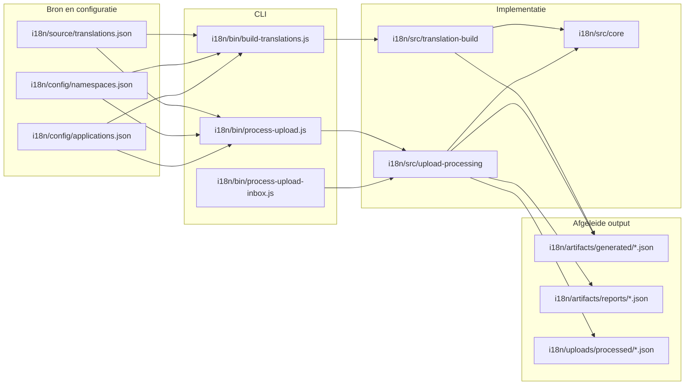
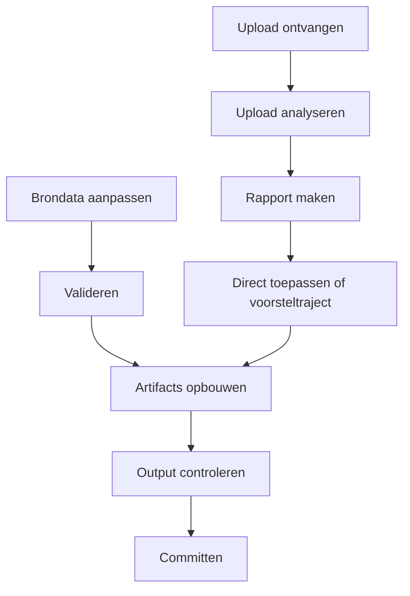
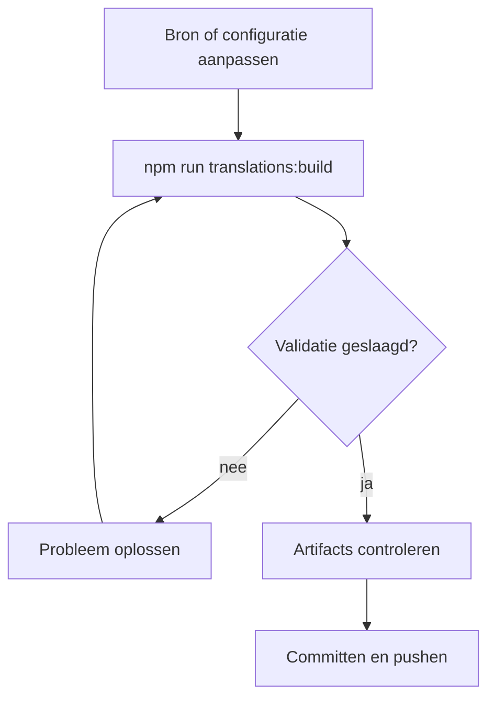
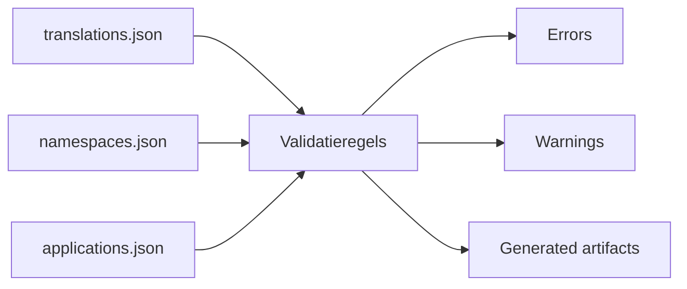
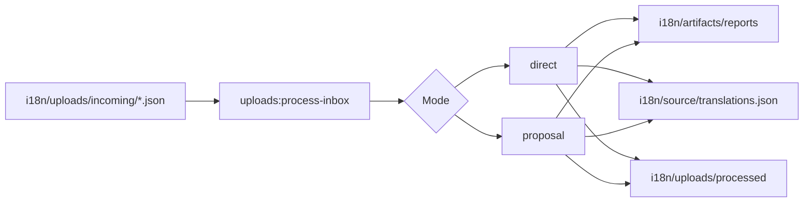
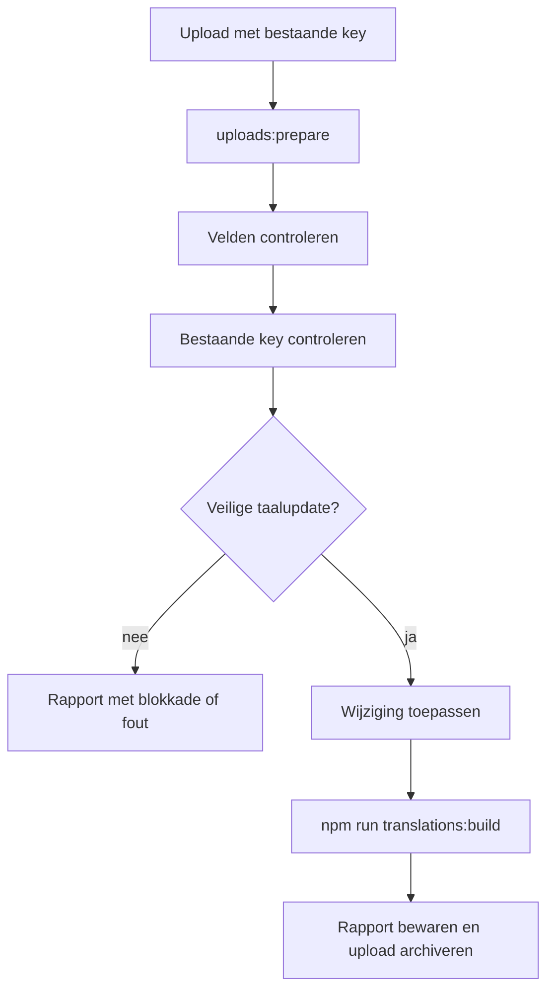
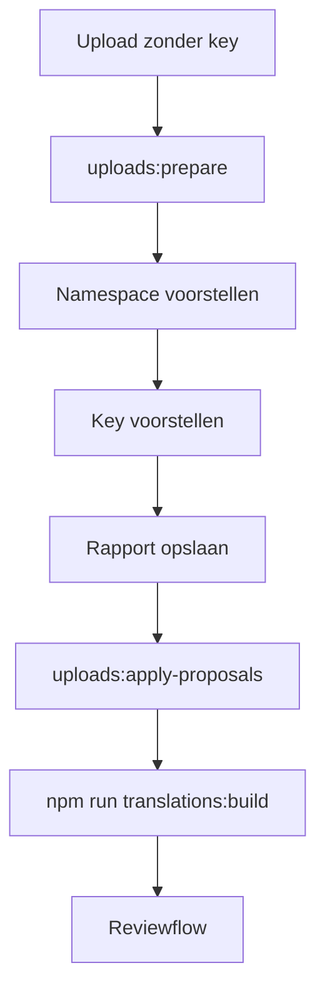
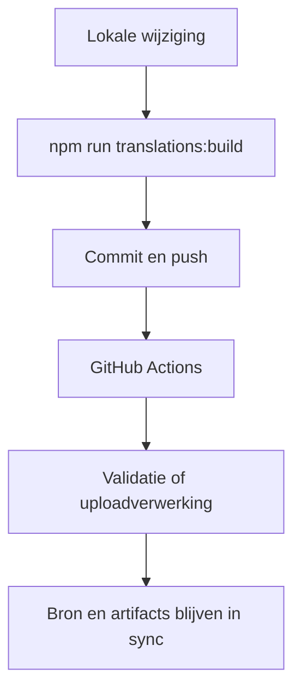

# MyPRAxIS Translation Keys

De centrale repository voor het beheren, valideren, opbouwen en verwerken van vertalingen binnen MyPRAxIS.

> [!IMPORTANT]
> Deze repository werkt bewust met één bron van waarheid.
> Handmatige inhoudelijke wijzigingen gebeuren in [`i18n/source/translations.json`](i18n/source/translations.json).
> Alles onder [`i18n/artifacts/generated/`](i18n/artifacts/generated) is afgeleide output.

## Inhoud

- [Snel overzicht](#snel-overzicht)
- [Architectuur](#architectuur)
- [Ontwerpkeuzes](#ontwerpkeuzes)
- [Repositorystructuur](#repositorystructuur)
- [Belangrijkste bestanden](#belangrijkste-bestanden)
- [Dagelijkse werkwijze](#dagelijkse-werkwijze)
- [Build en validatie](#build-en-validatie)
- [Uploadverwerking](#uploadverwerking)
- [Commando-overzicht](#commando-overzicht)
- [Praktische regels](#praktische-regels)
- [Automatisering](#automatisering)
- [Veelgemaakte fouten](#veelgemaakte-fouten)
- [Samenvatting](#samenvatting)

## Snel overzicht

| Onderdeel | Rol |
| --- | --- |
| [`i18n/source/`](i18n/source) | Handmatig beheerde brondata |
| [`i18n/config/`](i18n/config) | Toegestane namespaces, applicaties en schema's |
| [`i18n/bin/`](i18n/bin) | CLI-entrypoints |
| [`i18n/src/`](i18n/src) | Interne implementatie van build- en uploadlogica |
| [`i18n/artifacts/generated/`](i18n/artifacts/generated) | Gegenereerde runtime- en controlegegevens |
| [`i18n/artifacts/reports/`](i18n/artifacts/reports) | Rapporten van uploadverwerking |
| [`i18n/uploads/`](i18n/uploads) | Inbox en archief van uploadbestanden |

### Kernidee

De repository is opgebouwd rond drie heldere principes:

1. Er is één inhoudelijke bron.
2. Configuratie staat los van content.
3. Gegenereerde output wordt altijd opnieuw opgebouwd.

## Architectuur



### Functionele stroom



## Ontwerpkeuzes

### Eén bron van waarheid

Alle inhoudelijke wijzigingen starten in [`i18n/source/translations.json`](i18n/source/translations.json). Daarmee is altijd duidelijk waar een vertaling vandaan komt.

### Afspraken zijn expliciet

Namespaces en applicaties zijn geen mondelinge afspraken, maar formele configuratie in:

- [`i18n/config/namespaces.json`](i18n/config/namespaces.json)
- [`i18n/config/applications.json`](i18n/config/applications.json)

### Output is vervangbaar

Bestanden onder [`i18n/artifacts/generated/`](i18n/artifacts/generated) zijn per definitie opnieuw te maken. Dat maakt controle in CI en lokale validatie betrouwbaar.

### Uploads zijn tijdelijk

Uploads horen niet rechtstreeks bij de blijvende bron. Ze worden eerst gelezen, beoordeeld, gerapporteerd en pas daarna eventueel verwerkt.

## Repositorystructuur

```text
i18n/
├── artifacts/
│   ├── generated/            # afgeleide runtime- en controlegegevens
│   └── reports/              # rapporten van uploadverwerking
├── bin/                      # CLI-entrypoints
├── config/                   # formele configuratie en JSON-schema's
├── source/                   # handmatig beheerde brondata
├── src/
│   ├── core/                 # gedeelde helpers, padconfig en JSON-IO
│   ├── translation-build/    # validatie, analyse, rapportage en generatie
│   └── upload-processing/    # uploadanalyse, voorstellen en inboxflow
└── uploads/
    ├── incoming/             # nieuwe uploadbestanden
    └── processed/            # verwerkte en gearchiveerde uploads

scripts/
└── update-translations.sh    # lokale helper voor build, commit, push en pull
```

## Belangrijkste bestanden

### Bron en configuratie

- [`i18n/source/translations.json`](i18n/source/translations.json)
  Centrale lijst met alle vertaalregels.

- [`i18n/config/namespaces.json`](i18n/config/namespaces.json)
  Bepaalt welke namespaces toegestaan zijn en welke standaardnamespace gebruikt wordt.

- [`i18n/config/applications.json`](i18n/config/applications.json)
  Bepaalt welke applicatie-id's toegestaan zijn.

- [`i18n/config/translations.schema.json`](i18n/config/translations.schema.json)
  Beschrijft de vorm van de vertaalbron.

- [`i18n/config/upload.schema.json`](i18n/config/upload.schema.json)
  Beschrijft de vorm van uploadpayloads.

### Tooling

- [`i18n/bin/build-translations.js`](i18n/bin/build-translations.js)
  Startpunt voor build, check, validate, report en namespace-overzicht.

- [`i18n/bin/process-upload.js`](i18n/bin/process-upload.js)
  Startpunt voor één upload of één uploadrapport.

- [`i18n/bin/process-upload-inbox.js`](i18n/bin/process-upload-inbox.js)
  Startpunt voor batchverwerking van de inbox.

### Gegenereerde output

- [`i18n/artifacts/generated/`](i18n/artifacts/generated)
  Bevat runtimebestanden, metadata, registry en samenvattingen.

<details>
<summary><strong>Welke bestanden worden opgebouwd?</strong></summary>

| Bestand | Doel |
| --- | --- |
| `en.json` | Engelse runtimeboom |
| `fr.json` | Franse runtimeboom |
| `nl.json` | Nederlandse runtimeboom |
| `keys.json` | Platte lijst met alle keys |
| `namespaces.json` | Namespace-overzicht met tellingen |
| `applications.json` | Toepassingsmetadata voor gebruik elders |
| `registry.json` | Uitgebreide registratie per key |
| `summary.json` | Compacte samenvatting voor controle en CI |

</details>

## Dagelijkse werkwijze

Voor de meeste wijzigingen is de route kort en voorspelbaar:

1. Pas [`i18n/source/translations.json`](i18n/source/translations.json) aan.
2. Pas alleen indien nodig [`i18n/config/namespaces.json`](i18n/config/namespaces.json) aan.
3. Pas alleen indien nodig [`i18n/config/applications.json`](i18n/config/applications.json) aan.
4. Draai `npm run translations:build`.
5. Controleer de output in [`i18n/artifacts/generated/`](i18n/artifacts/generated).
6. Commit pas als bron en output samen kloppen.



## Build en validatie

### Wat de build leest

- [`i18n/source/translations.json`](i18n/source/translations.json)
- [`i18n/config/namespaces.json`](i18n/config/namespaces.json)
- [`i18n/config/applications.json`](i18n/config/applications.json)

### Wat de build schrijft

Alle output komt terecht in [`i18n/artifacts/generated/`](i18n/artifacts/generated).

### Waarom deze scheiding belangrijk is

Deze scheiding zorgt ervoor dat:

- output opnieuw opgebouwd kan worden zonder handwerk
- CI objectief kan controleren of de repo in sync is
- fouten terug te leiden zijn naar bron of configuratie

### Validatiemodel



## Uploadverwerking

Uploads zijn bedoeld voor editorflows. Ze worden niet gezien als primaire brondata.

Er zijn twee paden:

- directe updates voor bestaande keys
- voorstellen voor nieuwe keys

### Overzicht uploadstroom



### Directe updates

Gebruik dit pad alleen wanneer de key al bestaat.

Toegestaan:

- een bestaande `key` meesturen
- `nl`, `fr` of `en` aanpassen

Niet toegestaan:

- onbekende keys gebruiken
- extra velden meesturen buiten de uploadstructuur
- een nieuwe key toevoegen via dit pad



### Voorsteltraject

Gebruik dit pad wanneer er nog geen key bestaat.

In dat geval:

- stuur je geen `key` mee
- bepaalt het systeem een waarschijnlijke namespace
- wordt een key voorgesteld
- wordt pas daarna beslist of de wijziging opgenomen wordt



<details>
<summary><strong>Waarom uploads niet rechtstreeks in de bron terechtkomen</strong></summary>

Dit voorkomt onder meer:

- ongecontroleerde nieuwe keys
- inconsistente namespaces
- structurele wijzigingen via frontendflows
- vervuiling van de bron door onvolledige of foutieve payloads

</details>

## Commando-overzicht

| Commando | Gebruik |
| --- | --- |
| `npm run translations:build` | Valideert en genereert alle artifacts opnieuw |
| `npm run translations:check` | Controleert of de gegenereerde artifacts nog overeenkomen met de bron |
| `npm run translations:validate` | Faalt zodra er waarschuwingen of fouten zijn |
| `npm run translations:report` | Toont een samenvatting van namespaces, regels, fouten en waarschuwingen |
| `npm run translations:list-namespaces` | Toont alle geconfigureerde namespaces |
| `npm run uploads:prepare -- --input <file>` | Analyseert één uploadbestand en maakt een rapport |
| `npm run uploads:apply-proposals -- --input <report-file>` | Neemt voorstelregels uit een rapport over in de bron |
| `npm run uploads:process-inbox -- --mode direct` | Verwerkt inboxbestanden als directe updates |
| `npm run uploads:process-inbox -- --mode proposal` | Verwerkt inboxbestanden als voorsteltraject |
| `npm run update` | Draait de lokale standaardflow voor build, commit, push en synchronisatie |

## Praktische regels

> [!NOTE]
> Als je twijfelt waar een wijziging thuishoort, begin dan niet in `artifacts/` of `uploads/`.
> Begin bijna altijd in `source/`, `config/` of `src/`.

### Functionele regels

- Elke vertaalregel moet een unieke key hebben.
- Elke vertaalregel moet minstens één applicatie bevatten.
- Een namespace moet vooraf bestaan in `i18n/config/namespaces.json`.
- Een applicatie-id moet vooraf bestaan in `i18n/config/applications.json`.
- Bestanden in `i18n/artifacts/generated/` worden nooit handmatig aangepast.
- Bestaande keys kunnen rechtstreeks bijgewerkt worden als het om veilige taalupdates gaat.
- Nieuwe keys volgen altijd het voorsteltraject.

### Praktische vuistregels

- pas inhoud aan in `i18n/source/`
- pas afspraken aan in `i18n/config/`
- pas tooling aan in `i18n/src/`
- gebruik `i18n/bin/` om processen te starten
- beschouw `i18n/uploads/` als tijdelijke verwerkingsruimte

## Automatisering

De repository bevat twee centrale GitHub Actions-workflows:

- [`.github/workflows/buildTranslations.yml`](.github/workflows/buildTranslations.yml)
  Controleert wijzigingen in bron en configuratie, valideert de tooling en regenereert artifacts op `main`.

- [`.github/workflows/processTranslationUploads.yml`](.github/workflows/processTranslationUploads.yml)
  Verwerkt editor-uploads uit `i18n/uploads/incoming/`, schrijft rapporten weg en archiveert verwerkte uploads.

### Samenhang tussen lokaal werk en CI



## Veelgemaakte fouten

> [!WARNING]
> De meeste problemen ontstaan niet in de tooling, maar doordat bron, configuratie en output door elkaar gehaald worden.

- rechtstreeks werken in `i18n/artifacts/generated/`
- nieuwe namespaces gebruiken zonder `i18n/config/namespaces.json` aan te passen
- nieuwe applicatie-id's gebruiken zonder `i18n/config/applications.json` aan te passen
- uploads behandelen alsof ze blijvende brondata zijn
- alleen output committen zonder de echte bronwijziging

## Samenvatting

Als je deze repository in één model wilt onthouden, is dit de juiste verdeling:

- [`i18n/source/`](i18n/source) is de bron
- [`i18n/config/`](i18n/config) bepaalt de grenzen
- [`i18n/src/`](i18n/src) bevat de logica
- [`i18n/bin/`](i18n/bin) start de processen
- [`i18n/artifacts/`](i18n/artifacts) bevat afgeleide output
- [`i18n/uploads/`](i18n/uploads) is tijdelijke invoer en archief

Zolang die scheiding bewaakt blijft, blijft het project overzichtelijk voor developers, betrouwbaar in CI en veilig voor editor-gestuurde wijzigingen.
