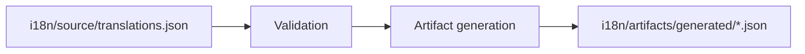
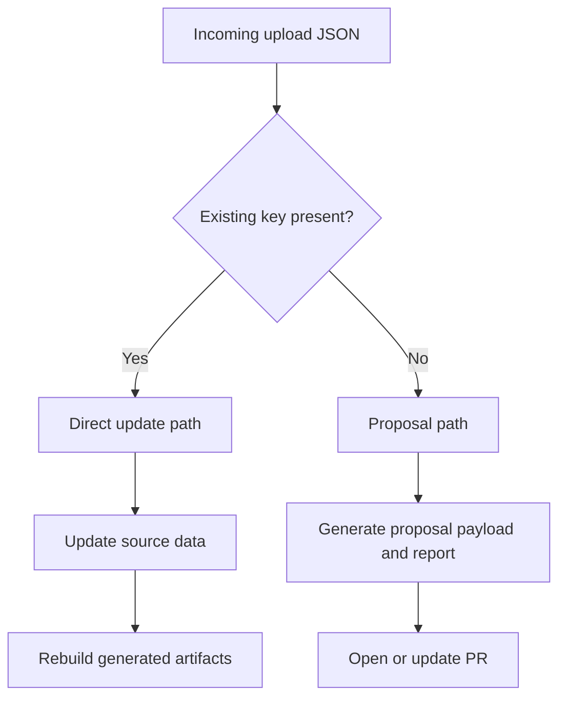
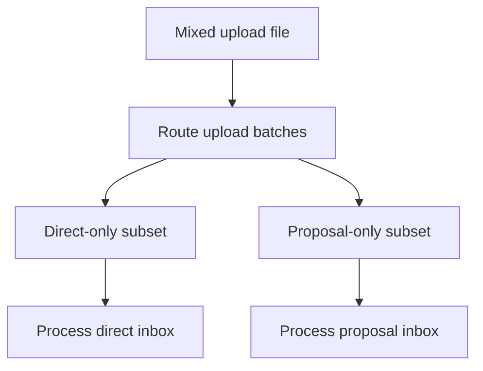

# MyPRAxIS Translation Keys

[](https://github.com/PRAxISDEVELOPMENT/mypraxis_translation_keys/actions/workflows/buildTranslations.yml)
[](https://github.com/PRAxISDEVELOPMENT/mypraxis_translation_keys/actions/workflows/processTranslationUploads.yml)
[](https://github.com/PRAxISDEVELOPMENT/mypraxis_translation_keys/actions/workflows/openTranslationProposalPr.yml)

Central repository for MyPRAxIS translation content, validation, generated runtime artifacts, upload routing, and proposal automation.

> [!IMPORTANT]
> The canonical source of truth is [i18n/source/translations.json](i18n/source/translations.json).
> Files under [i18n/artifacts/generated/](i18n/artifacts/generated/) are generated output and must not be edited manually.

## Quick Navigation

If you only need orientation, start here:

| I want to... | Go to... |
| --- | --- |
| browse the full documentation set | [docs/README.md](docs/README.md) |
| understand the full system quickly | [Mental Model](#mental-model) |
| see where each responsibility lives | [Repository Map](#repository-map) |
| know which command to run | [Command Guide](#command-guide) |
| process uploads from an app or editor | [Upload Flows](#upload-flows) |
| understand proposal PR automation | [GitHub Automation](#github-automation) |
| know which file to inspect for a bug or change | [Where To Look For What](#where-to-look-for-what) |
| understand day-to-day maintainer workflow | [Common Workflows](#common-workflows) |

## What This Repository Does

This repository exists to make translation work predictable, reviewable, and safe.

It combines five responsibilities:

1. store the canonical translation entries
2. validate translation structure and locale completeness
3. generate runtime-ready JSON artifacts for consumers
4. process editor/frontend uploads for existing keys
5. open a reviewable proposal path for new keys

The governing rule is simple:

- existing keys may be updated directly
- new keys must go through the proposal path

That split keeps normal copy updates fast while preventing unreviewed structural drift.

## Documentation Set

The root `README` is the fastest orientation layer. The deeper reference guides live in [`docs/`](docs/).

Use these when you need more than a quick overview:

| Document | Use it for... |
| --- | --- |
| [CONTRIBUTING.md](CONTRIBUTING.md) | contributor onboarding and working rules |
| [docs/README.md](docs/README.md) | documentation index and entry point |
| [docs/architecture.md](docs/architecture.md) | system structure, responsibilities, and extension rules |
| [docs/upload-processing.md](docs/upload-processing.md) | direct-update, proposal, and mixed-batch upload flows |
| [docs/github-automation.md](docs/github-automation.md) | GitHub Actions, proposal PR automation, and branch behavior |
| [docs/maintainer-workflow.md](docs/maintainer-workflow.md) | day-to-day maintainer tasks, local workflow, and troubleshooting |

## Mental Model

The system becomes much easier to reason about if you separate it into six layers:

1. `i18n/source/`
   Canonical data that humans are allowed to change.
2. `i18n/config/`
   Rules: allowed namespaces, applications, and upload schema.
3. `i18n/src/`
   Actual implementation: validation, generation, routing, and upload logic.
4. `i18n/bin/`
   CLI entry points that expose the implementation.
5. `i18n/artifacts/generated/`
   Derived output for consumers. Always reproducible from source.
6. `i18n/uploads/`
   Temporary operational state for queued and processed upload payloads.

If you remember only one sentence, remember this:

`source` is edited, `config` defines the rules, `src` contains the logic, `bin` runs it, `artifacts/generated` is derived output, and `uploads` is workflow state.

## End-To-End Overview

### Main Build Flow



### Upload Flow



### Mixed Batch Flow



## Repository Map

```text
i18n/
├── artifacts/
│   ├── generated/            # derived runtime and metadata files
│   └── reports/              # processing and routing reports
├── bin/                      # CLI entry points
├── config/                   # namespaces, applications, and schemas
├── source/                   # canonical translation source
├── src/
│   ├── core/                 # shared helpers and IO
│   ├── translation-build/    # validation and artifact generation
│   └── upload-processing/    # upload analysis, routing, inbox, proposals
└── uploads/
    ├── incoming/             # queued upload payloads
    └── processed/            # archived processed payloads

scripts/
├── check-node-syntax.sh
└── update-translations.sh

.github/
└── workflows/
    ├── buildTranslations.yml
    ├── processTranslationUploads.yml
    └── openTranslationProposalPr.yml
```

## Where To Look For What

| If you need to inspect... | Start with... | Why |
| --- | --- | --- |
| canonical translations | [i18n/source/translations.json](i18n/source/translations.json) | this is the source of truth |
| allowed namespaces | [i18n/config/namespaces.json](i18n/config/namespaces.json) | defines valid namespace space and defaults |
| allowed app identifiers | [i18n/config/applications.json](i18n/config/applications.json) | validates app targeting |
| upload payload shape | [i18n/config/upload.schema.json](i18n/config/upload.schema.json) | schema contract for editor/frontend uploads |
| translation validation/build behavior | [i18n/src/translation-build/](i18n/src/translation-build/) | all build-time logic lives here |
| upload routing and proposal logic | [i18n/src/upload-processing/](i18n/src/upload-processing/) | all upload decision logic lives here |
| shared file, config, and JSON helpers | [i18n/src/core/](i18n/src/core/) | common utilities used by both systems |
| the CLI command surface | [i18n/bin/](i18n/bin/) | thin wrappers around implementation |
| generated runtime output | [i18n/artifacts/generated/](i18n/artifacts/generated/) | produced by the build process |
| upload reports | [i18n/artifacts/reports/](i18n/artifacts/reports/) | generated reports for routing/proposals |
| queued upload files | [i18n/uploads/incoming/](i18n/uploads/incoming/) | inbox for work waiting to be processed |
| already-processed upload files | [i18n/uploads/processed/](i18n/uploads/processed/) | archive trail |
| developer convenience workflow | [scripts/update-translations.sh](scripts/update-translations.sh) | local build, commit, push, wait, sync |

## Key Files

| File | Purpose |
| --- | --- |
| [i18n/source/translations.json](i18n/source/translations.json) | canonical translation entries |
| [i18n/config/namespaces.json](i18n/config/namespaces.json) | valid namespaces and defaults |
| [i18n/config/applications.json](i18n/config/applications.json) | valid application identifiers |
| [i18n/config/upload.schema.json](i18n/config/upload.schema.json) | upload payload contract |
| [i18n/config/translations.schema.json](i18n/config/translations.schema.json) | source file validation shape |
| [i18n/bin/build-translations.js](i18n/bin/build-translations.js) | CLI entry point for validation and artifact generation |
| [i18n/bin/process-upload.js](i18n/bin/process-upload.js) | CLI entry point for single-upload analysis and proposal application |
| [i18n/bin/process-upload-inbox.js](i18n/bin/process-upload-inbox.js) | CLI entry point for inbox processing |
| [i18n/bin/route-upload-batches.js](i18n/bin/route-upload-batches.js) | CLI entry point for mixed-batch routing |
| [i18n/bin/simulate-upload.js](i18n/bin/simulate-upload.js) | local upload simulation helper |
| [scripts/check-node-syntax.sh](scripts/check-node-syntax.sh) | syntax-check helper |
| [scripts/update-translations.sh](scripts/update-translations.sh) | interactive developer workflow helper |

## Data Model

### Canonical Source

The repository is centered on one canonical file:

- [i18n/source/translations.json](i18n/source/translations.json)

Each entry represents one translation key and includes:

- a stable `key`
- a namespace association
- application targeting
- locale values such as `nl`, `fr`, and `en`

### Generated Output

Build output is written to:

- [i18n/artifacts/generated/applications.json](i18n/artifacts/generated/applications.json)
- [i18n/artifacts/generated/namespaces.json](i18n/artifacts/generated/namespaces.json)
- [i18n/artifacts/generated/registry.json](i18n/artifacts/generated/registry.json)
- locale files like [i18n/artifacts/generated/nl.json](i18n/artifacts/generated/nl.json), [i18n/artifacts/generated/fr.json](i18n/artifacts/generated/fr.json), and [i18n/artifacts/generated/en.json](i18n/artifacts/generated/en.json)
- summary files like [i18n/artifacts/generated/summary.json](i18n/artifacts/generated/summary.json) and [i18n/artifacts/generated/keys.json](i18n/artifacts/generated/keys.json)

These files are products of the source plus the rules. They should be treated as build artifacts, not handwritten content.

## Validation And Build

The translation build side is responsible for:

- loading the canonical source
- validating structure and configured namespaces/apps
- checking locale completeness and consistency
- generating derived artifacts
- checking whether committed artifacts are in sync with source

The implementation lives in:

- [i18n/src/translation-build/](i18n/src/translation-build/)

Typical entry points:

```bash
npm run translations:build
npm run translations:check
npm run translations:report
npm run translations:validate
```

Use them like this:

- `translations:build`: validate and regenerate derived files
- `translations:check`: confirm generated files already match source
- `translations:report`: print a fuller health report
- `translations:validate`: stricter validation mode for CI or gatekeeping

## Upload Flows

Uploads exist so apps or editors can submit translation changes without directly editing the source file by hand.

### Upload Payload Shape

```json
{
  "version": 1,
  "source": "frontend-editor",
  "entries": [
    {
      "key": "common.save",
      "nl": "Opslaan"
    },
    {
      "nl": "Nieuwe knop",
      "fr": "Nouveau bouton",
      "en": "New button",
      "description": "New scheduling CTA"
    }
  ]
}
```

Rules:

- include `key` only for existing translations
- omit `key` for new-key proposals
- supported locales are `nl`, `fr`, and `en`
- proposal entries may include `description` and `notes`

### Flow 1: Direct Update

Use this when the upload entry already references an existing key.

Expected behavior:

1. the upload is classified as a direct update
2. locale updates are validated
3. canonical source is updated safely
4. generated artifacts are rebuilt
5. processed payloads are archived

### Flow 2: Proposal

Use this when the upload entry introduces a new translation that does not yet have a key.

Expected behavior:

1. the upload is classified as a proposal
2. namespace and key suggestions are generated
3. proposal payload/report is produced
4. automation opens or updates a PR for review

### Flow 3: Mixed Batch

Use this when one upload file contains both known-key edits and new-key proposals.

Expected behavior:

1. the batch is routed into direct-only and proposal-only subsets
2. each subset enters the correct processing path
3. reports are generated for traceability

### Upload Commands

```bash
npm run uploads:prepare -- --input path/to/upload.json
npm run uploads:route
npm run uploads:process-inbox -- --mode direct
npm run uploads:process-inbox -- --mode proposal
npm run uploads:apply-proposals -- --input path/to/report.json
```

What they do:

- `uploads:prepare`: analyze one upload payload
- `uploads:route`: split mixed batches
- `uploads:process-inbox -- --mode direct`: process direct-update inbox files
- `uploads:process-inbox -- --mode proposal`: process proposal inbox files
- `uploads:apply-proposals`: apply proposals from a generated report

## Local Testing

Use the simulation helper when you want to test the upload path locally without manually crafting inbox files.

### Simulate An Existing Key Update

```bash
npm run uploads:simulate -- edit --key common.save --fr "Enregistrer depuis l'app"
```

### Simulate A New Translation Proposal

```bash
npm run uploads:simulate -- new --nl "Nieuwe knop" --fr "Nouveau bouton" --en "New button"
```

Both commands default to dry run mode.

Use `--apply` if you want to update local source data and regenerate artifacts:

```bash
npm run uploads:simulate -- edit --key common.save --fr "Enregistrer depuis l'app" --apply
npm run uploads:simulate -- new --nl "Nieuwe knop" --fr "Nouveau bouton" --en "New button" --apply
```

## Common Workflows

### I want to change an existing translation manually

1. edit [i18n/source/translations.json](i18n/source/translations.json)
2. run `npm run translations:build`
3. inspect the generated output
4. commit both source and generated changes

### I want to validate the repository before committing

```bash
npm run tooling:check-syntax
npm run translations:check
```

### I want to process uploads sitting in the inbox

```bash
npm run uploads:route
npm run uploads:process-inbox -- --mode direct
npm run uploads:process-inbox -- --mode proposal
```

### I want a guided developer push flow

```bash
npm run update
```

That helper script:

1. builds translations locally
2. asks for a commit message
3. stages and commits changes
4. pushes the current branch
5. optionally waits for relevant GitHub Actions
6. pulls the latest branch state back locally

## GitHub Automation

This repository uses three GitHub Actions workflows:

| Workflow | Purpose |
| --- | --- |
| [.github/workflows/buildTranslations.yml](.github/workflows/buildTranslations.yml) | validate translation changes and regenerate generated artifacts |
| [.github/workflows/processTranslationUploads.yml](.github/workflows/processTranslationUploads.yml) | route and process incoming upload batches |
| [.github/workflows/openTranslationProposalPr.yml](.github/workflows/openTranslationProposalPr.yml) | open or update proposal pull requests for new keys |

### Proposal PR Behavior

Proposal pull requests are structured for review:

- they target `main`
- labels are applied automatically
- reviewer routing can be configured through repository variables
- generated report information can be included in the PR body

Repository variables used by proposal automation:

- `TRANSLATION_PROPOSAL_REVIEWERS`
- `TRANSLATION_PROPOSAL_TEAM_REVIEWERS`
- `TRANSLATION_PROPOSAL_ASSIGNEES`

## Command Guide

| Command | Purpose |
| --- | --- |
| `npm run help` | print the main translation help output |
| `npm run tooling:check-syntax` | syntax-check all Node CLI and implementation files |
| `npm run translations:build` | validate source and regenerate derived files |
| `npm run translations:check` | verify generated artifacts are in sync |
| `npm run translations:validate` | fail on warnings or errors |
| `npm run translations:report` | print a full validation report |
| `npm run translations:list-namespaces` | list configured namespaces |
| `npm run uploads:help` | print help for single-upload processing |
| `npm run uploads:prepare -- --input <file>` | analyze one upload payload |
| `npm run uploads:apply-proposals -- --input <report-file>` | apply proposals from a report |
| `npm run uploads:process-inbox:help` | print help for inbox processing |
| `npm run uploads:process-inbox -- --mode direct` | process direct-update batches |
| `npm run uploads:process-inbox -- --mode proposal` | process proposal batches |
| `npm run uploads:route` | split mixed upload files into direct and proposal batches |
| `npm run uploads:route:help` | print help for upload routing |
| `npm run uploads:simulate -- edit ...` | simulate an existing-key upload |
| `npm run uploads:simulate -- new ...` | simulate a new-key upload |
| `npm run uploads:simulate:help` | print help for upload simulation |
| `npm run update` | build, commit, push, wait, and sync the current branch |

## Operational Rules

- never edit files under `i18n/artifacts/generated/` manually
- keep [i18n/source/translations.json](i18n/source/translations.json) as the canonical source
- direct updates must use existing keys only
- new keys must enter through the proposal path
- every entry must use an allowed namespace
- every entry must include at least one allowed application

## Troubleshooting

### Generated files changed unexpectedly

Run:

```bash
npm run translations:build
git diff
```

This usually means source data or validation rules changed and the artifacts were correctly regenerated.

### `translations:check` fails

That means committed generated output is out of sync with the canonical source. Rebuild with:

```bash
npm run translations:build
```

### Upload processing is confusing

Start with this decision rule:

- known key present: direct update
- no key present: proposal
- mixed file: route first, then process both paths

### I do not know where a behavior is implemented

Use this shortcut:

- validation/build behavior: `i18n/src/translation-build/`
- upload behavior: `i18n/src/upload-processing/`
- shared utility behavior: `i18n/src/core/`
- CLI wiring: `i18n/bin/`

## Getting Help

- for repository-level work, open an issue in this repository
- for translation proposal review, use the generated pull request discussion
- for local workflow questions, start with `npm run help` and the command-specific `:help` scripts

## Maintainers

Maintained by [PRAxISDEVELOPMENT](https://github.com/PRAxISDEVELOPMENT).

## Summary

If you need the shortest possible project model:

- source lives in `i18n/source/`
- rules live in `i18n/config/`
- logic lives in `i18n/src/`
- entry points live in `i18n/bin/`
- runtime output lives in `i18n/artifacts/generated/`
- upload state lives in `i18n/uploads/`

That separation is what keeps the system traceable, reviewable, and automatable.
