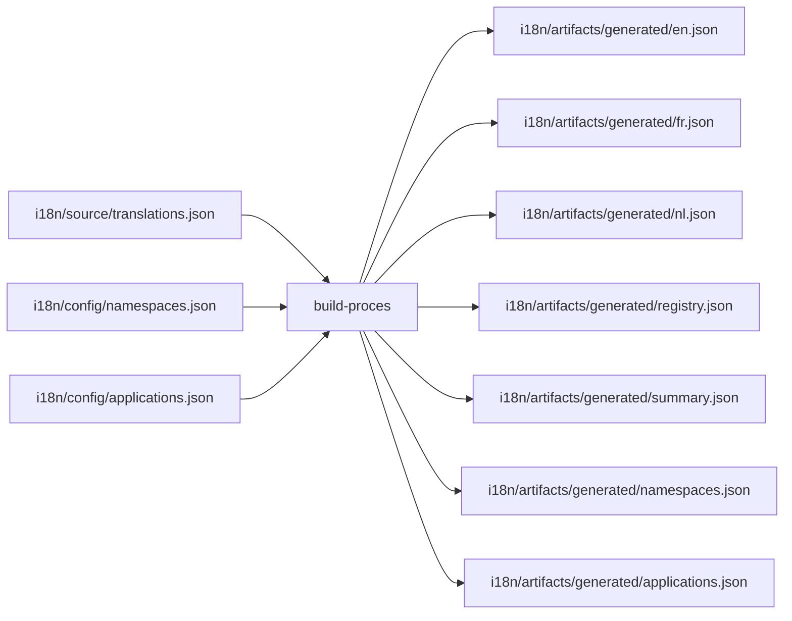
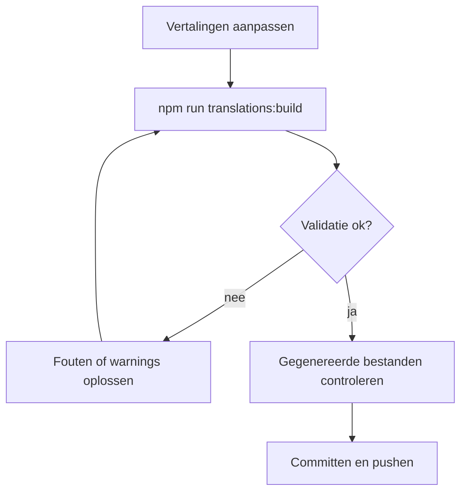
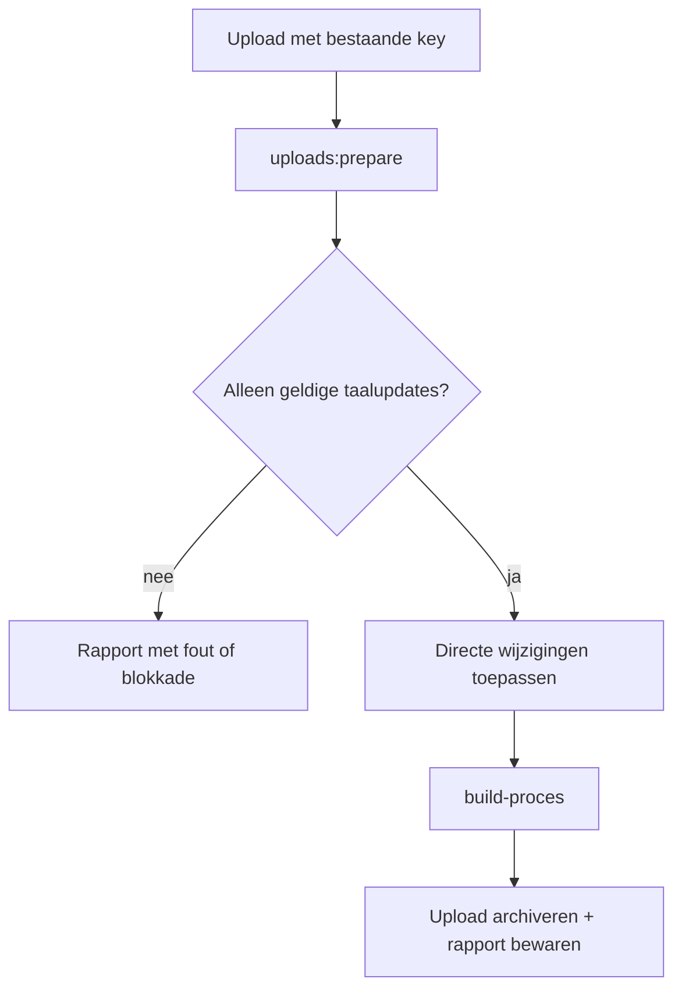
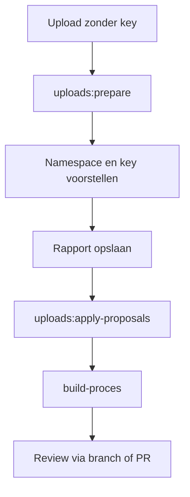

# MyPRAxIS Translation Keys

Deze repository is de centrale plek voor alle vertaalsleutels van MyPRAxIS.

Hier beheer je:

- de brondata van vertalingen
- de lijst met toegestane namespaces
- de lijst met toegestane applicaties
- de gegenereerde outputbestanden
- de verwerking van uploads uit de editorflow

Het uitgangspunt is simpel: er is maar één bronbestand dat je handmatig aanpast. Alles wat daaruit volgt, wordt opnieuw opgebouwd.

## Waarvoor dient deze repo?

Zonder duidelijke afspraken lopen vertalingen snel uit elkaar. Dan krijg je bijvoorbeeld:

- dubbele keys
- verschillende schrijfwijzen voor dezelfde namespace
- applicaties die niet meer kloppen
- losse JSON-bestanden die handmatig aangepast zijn
- uploads die niet duidelijk gescheiden zijn van de echte brondata

Deze repo houdt dat bewust strak:

- `i18n/source/` bevat de bron
- `i18n/config/` bevat de afspraken
- `i18n/artifacts/` bevat alleen afgeleide bestanden
- `i18n/uploads/` bevat tijdelijke uploadbestanden en archief
- `i18n/src/` bevat de logica van de tooling

## Overzicht



## Projectstructuur

```text
i18n/
├── artifacts/
│   ├── generated/            # opgebouwd uit de bron; niet handmatig aanpassen
│   └── reports/              # rapporten van uploadverwerking
├── bin/                      # CLI entrypoints
├── config/                   # namespaces, applications en JSON-schema's
├── source/                   # de enige handmatig bewerkte brondata
├── src/
│   ├── core/                 # gedeelde helpers en padconfig
│   ├── translation-build/    # validatie, rapportage en generatie
│   └── upload-processing/    # uploadlogica voor prepare/apply/inbox
└── uploads/
    ├── incoming/             # nieuwe uploads die nog verwerkt moeten worden
    └── processed/            # verwerkte uploads

scripts/
└── update-translations.sh    # lokale helper voor build, commit, push en pull
```

## Belangrijkste bestanden

- [`i18n/source/translations.json`](i18n/source/translations.json)
  De centrale bron van alle vertaalregels.

- [`i18n/config/namespaces.json`](i18n/config/namespaces.json)
  De lijst met toegestane namespaces en de standaardnamespace.

- [`i18n/config/applications.json`](i18n/config/applications.json)
  De lijst met toegestane applicatie-id's.

- [`i18n/artifacts/generated/`](i18n/artifacts/generated)
  De opgebouwde bestanden voor runtime, controle en rapportage.

## Commando's

| Commando | Wat doet het? |
| --- | --- |
| `npm run translations:build` | Valideert de bron en schrijft alle gegenereerde bestanden opnieuw weg |
| `npm run translations:check` | Controleert of de gegenereerde bestanden nog in sync zijn |
| `npm run translations:validate` | Faalt zodra er warnings of errors zijn |
| `npm run translations:report` | Toont een compacte samenvatting van de staat van de vertalingen |
| `npm run translations:list-namespaces` | Toont alle namespaces met hun status |
| `npm run uploads:prepare -- --input <file>` | Analyseert één uploadbestand en maakt een rapport |
| `npm run uploads:apply-proposals -- --input <report-file>` | Voegt voorstelregels uit een rapport toe aan de bron |
| `npm run uploads:process-inbox -- --mode direct` | Verwerkt inboxbestanden voor directe updates |
| `npm run uploads:process-inbox -- --mode proposal` | Verwerkt inboxbestanden voor voorstelbranches |
| `npm run update` | Draait de lokale buildflow, commit, push en haalt daarna de laatste stand op |

## Dagelijkse workflow

Voor gewone wijzigingen is de route kort:

1. Pas [`i18n/source/translations.json`](i18n/source/translations.json) aan.
2. Voeg alleen een namespace toe als dat echt nodig is in [`i18n/config/namespaces.json`](i18n/config/namespaces.json).
3. Voeg alleen een applicatie-id toe of wijzig die in [`i18n/config/applications.json`](i18n/config/applications.json).
4. Draai `npm run translations:build`.
5. Controleer de output in [`i18n/artifacts/generated/`](i18n/artifacts/generated).



## Hoe uploadverwerking werkt

Er zijn twee soorten uploads:

- directe updates voor bestaande keys
- voorstellen voor nieuwe keys

### 1. Directe update van een bestaande key

Gebruik dit pad wanneer de key al bestaat en alleen een vertaling aangepast moet worden.

Voorbeelden van wat wel mag:

- `nl`, `fr` of `en` aanpassen
- een bestaande key opnieuw aanleveren

Wat niet mag:

- extra velden meesturen
- een onbekende key gebruiken
- via dit pad een nieuwe key proberen toe te voegen



### 2. Voorstel voor een nieuwe key

Gebruik dit pad wanneer er nog geen key bestaat.

In dat geval:

- stuur je geen `key` mee
- probeert het systeem een namespace te kiezen
- wordt een voorstel voor een nieuwe key gemaakt
- gaat de wijziging langs review



## Regels van dit project

- Bewerk nooit handmatig bestanden in `i18n/artifacts/generated/`.
- Elke vertaalregel moet een unieke key hebben.
- Elke vertaalregel moet minstens één application bevatten.
- Een namespace moet eerst bestaan in `i18n/config/namespaces.json`.
- Een application-id moet eerst bestaan in `i18n/config/applications.json`.
- Bestaande keys mogen direct bijgewerkt worden als het alleen om veilige taalupdates gaat.
- Nieuwe keys lopen altijd via het voorsteltraject.

## Wat waar thuishoort

Twijfel je waar een wijziging moet gebeuren, hou dan deze vuistregels aan:

- brondata aanpassen: `i18n/source/`
- afspraken aanpassen: `i18n/config/`
- tooling aanpassen: `i18n/src/`
- CLI gedrag starten: `i18n/bin/`
- output nakijken: `i18n/artifacts/generated/`
- uploadbestanden opvolgen: `i18n/uploads/` en `i18n/artifacts/reports/`

## Automatisering

- [`.github/workflows/buildTranslations.yml`](.github/workflows/buildTranslations.yml)
  Controleert wijzigingen in de bron en regenereert artifacts op `main`.

- [`.github/workflows/processTranslationUploads.yml`](.github/workflows/processTranslationUploads.yml)
  Verwerkt editor-uploads uit de inbox en archiveert de resultaten.

## Kort samengevat

Als je één ding onthoudt, laat het dit zijn:

- bewerk de bron in `i18n/source/`
- beheer afspraken in `i18n/config/`
- laat `i18n/artifacts/` door de tooling vullen

Dan blijft het project voorspelbaar, controleerbaar en schoon.
