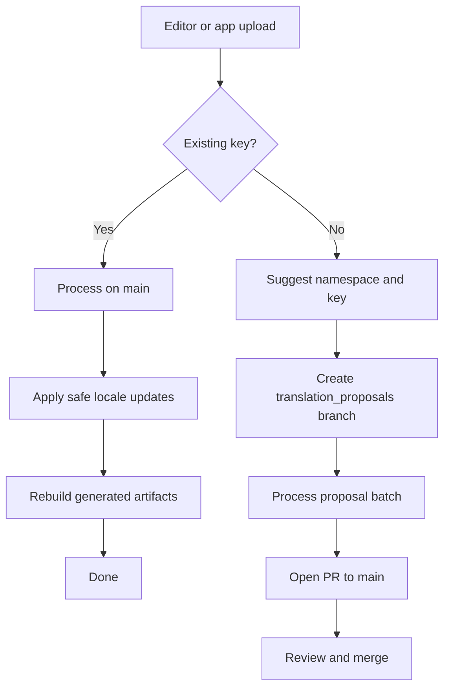
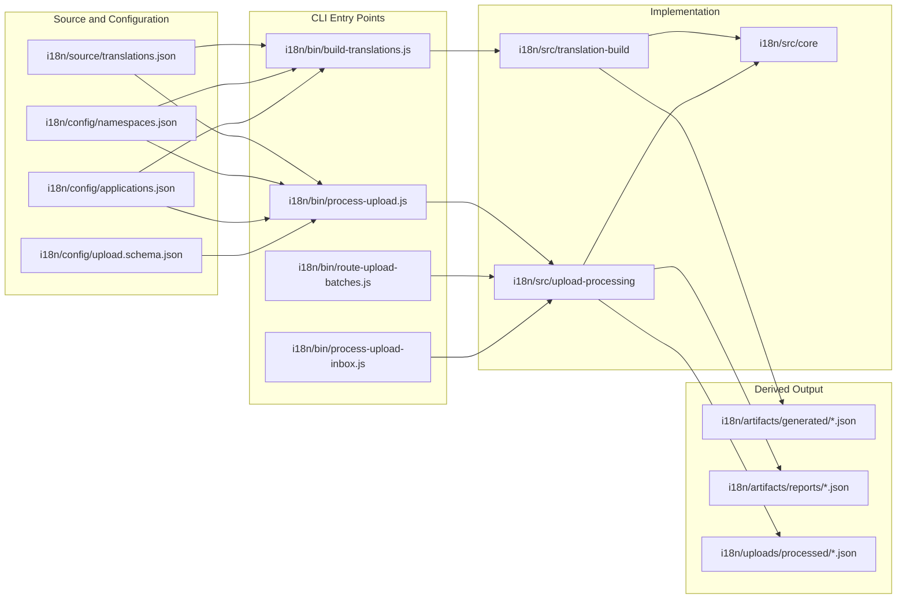
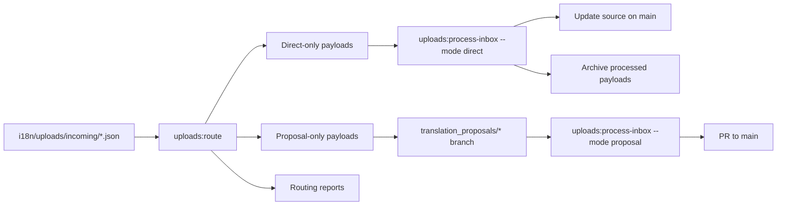

# MyPRAxIS Translation Keys

Central repository for managing, validating, building, and processing translations across MyPRAxIS.

> [!IMPORTANT]
> This repository has a single source of truth:
> [`i18n/source/translations.json`](i18n/source/translations.json).
> Everything under [`i18n/artifacts/generated/`](i18n/artifacts/generated) is derived output.

## Table of Contents

- [Overview](#overview)
- [Operating Model](#operating-model)
- [Architecture](#architecture)
- [Repository Layout](#repository-layout)
- [Primary Workflows](#primary-workflows)
- [GitHub Automation](#github-automation)
- [Command Reference](#command-reference)
- [Operational Rules](#operational-rules)
- [Practical Notes](#practical-notes)

## Overview

This repository is built around three principles:

1. Translation content lives in one canonical source file.
2. Configuration is explicit and versioned.
3. Generated runtime files are always reproducible.

The system supports two distinct editor-facing behaviors:

- **Editing an existing key**
  Safe locale updates for existing keys continue to flow directly to `main`.

- **Adding a new key**
  New entries are treated as proposals. The system suggests a key, creates a proposal branch, and opens a pull request for review.

That split is the core design decision of this repository.

## Operating Model

### Existing key edits

Use this path when the incoming payload contains a known translation `key`.

- the update is processed on `main`
- only safe locale changes are applied
- generated artifacts are rebuilt on `main`
- no proposal PR is required

This keeps editorial work fast for admins and developers.

### New key additions

Use this path when the incoming payload does **not** contain an existing `key`.

- the system analyzes the text
- the system suggests a namespace
- the system generates a proposed key
- the proposal is processed on a `translation_proposals/*` branch
- GitHub automatically opens or updates a PR to `main`
- the PR is labeled for review and routed to the translation review team

This keeps structural changes controlled without slowing down normal editing.

### End-to-end flow



## Architecture

### Source, config, processing, output



### Upload routing model



## Repository Layout

```text
i18n/
├── artifacts/
│   ├── generated/            # generated runtime and metadata files
│   └── reports/              # upload and routing reports
├── bin/                      # CLI entry points
├── config/                   # namespaces, applications, and schemas
├── source/                   # canonical translation source
├── src/
│   ├── core/                 # shared helpers and IO
│   ├── translation-build/    # validation and artifact generation
│   └── upload-processing/    # upload classification, routing, and proposals
└── uploads/
    ├── incoming/             # queued editor uploads
    └── processed/            # archived processed uploads

.github/
├── CODEOWNERS
├── pull_request_template.md
└── workflows/
    ├── buildTranslations.yml
    ├── openTranslationProposalPr.yml
    └── processTranslationUploads.yml

scripts/
└── update-translations.sh
```

### Key files

- [`i18n/source/translations.json`](i18n/source/translations.json)
  Canonical list of translation entries.

- [`i18n/config/namespaces.json`](i18n/config/namespaces.json)
  Allowed namespaces and default namespace.

- [`i18n/config/applications.json`](i18n/config/applications.json)
  Allowed application identifiers.

- [`i18n/bin/build-translations.js`](i18n/bin/build-translations.js)
  Validation and artifact generation entry point.

- [`i18n/bin/process-upload.js`](i18n/bin/process-upload.js)
  Single upload preparation and proposal application entry point.

- [`i18n/bin/process-upload-inbox.js`](i18n/bin/process-upload-inbox.js)
  Batch processing entry point for queued uploads.

- [`i18n/bin/route-upload-batches.js`](i18n/bin/route-upload-batches.js)
  Splits mixed upload batches into direct updates and proposals.

## Primary Workflows

### 1. Manual source update

Use this when directly editing translation data in the repository.

1. Update [`i18n/source/translations.json`](i18n/source/translations.json).
2. Update [`i18n/config/namespaces.json`](i18n/config/namespaces.json) only if needed.
3. Update [`i18n/config/applications.json`](i18n/config/applications.json) only if needed.
4. Run `npm run translations:build`.
5. Verify the generated files in [`i18n/artifacts/generated/`](i18n/artifacts/generated).
6. Commit and push.

### 2. Existing key edit from the editor

Use this when an upload includes a known `key`.

1. The upload lands in `i18n/uploads/incoming`.
2. The processing workflow routes the batch.
3. Direct updates are applied on `main`.
4. Artifacts are rebuilt on `main`.
5. The payload is archived under `i18n/uploads/processed`.

### 3. New key proposal from the editor

Use this when an upload does not include an existing `key`.

1. The upload lands in `i18n/uploads/incoming`.
2. The routing step identifies proposal entries.
3. A suggested namespace and key are generated.
4. A `translation_proposals/*` branch is created automatically.
5. Proposal processing writes the new entry into that branch.
6. GitHub opens or updates a PR to `main`.
7. The review team receives a review request through GitHub.

### 4. Mixed upload batch

Mixed batches are fully supported.

If one upload file contains:

- existing-key edits
- new key proposals

the router splits them automatically so both paths continue independently.

## GitHub Automation

The repository uses three GitHub Actions workflows:

- [`.github/workflows/buildTranslations.yml`](.github/workflows/buildTranslations.yml)
  Validates source and configuration changes and rebuilds generated artifacts on `main`.

- [`.github/workflows/processTranslationUploads.yml`](.github/workflows/processTranslationUploads.yml)
  Processes editor uploads, routes mixed batches, applies direct updates on `main`, and creates proposal branches for new keys.

- [`.github/workflows/openTranslationProposalPr.yml`](.github/workflows/openTranslationProposalPr.yml)
  Opens or updates the PR for `translation_proposals/*` branches, applies labels, and requests reviewers.

### Proposal PR behavior

Proposal pull requests are designed to be review-ready:

- target branch: `main`
- labels:
  - `translation-proposal`
  - `needs-review`
  - `auto-generated`
- review routing:
  - individual reviewers through `TRANSLATION_PROPOSAL_REVIEWERS`
  - team reviewers through `TRANSLATION_PROPOSAL_TEAM_REVIEWERS`
  - assignees through `TRANSLATION_PROPOSAL_ASSIGNEES`
- PR body includes:
  - branch name
  - number of proposal reports
  - proposed keys
  - report file references

### Reviewer routing variables

Configure these in GitHub Actions repository variables when needed:

- `TRANSLATION_PROPOSAL_REVIEWERS`
  Comma-separated GitHub usernames.

- `TRANSLATION_PROPOSAL_TEAM_REVIEWERS`
  Comma-separated GitHub team slugs.

- `TRANSLATION_PROPOSAL_ASSIGNEES`
  Comma-separated GitHub usernames.

### CODEOWNERS

[`/.github/CODEOWNERS`](.github/CODEOWNERS) routes repository ownership to:

- `@PRAxISDEVELOPMENT/translation-admins`

That improves visibility and keeps review ownership explicit.

### Notifications and email

The repository does **not** send email directly.

GitHub sends notifications when review requests are created. Whether team members receive those by email depends on their own GitHub notification settings.

## Command Reference

| Command | Purpose |
| --- | --- |
| `npm run translations:build` | Validate the source and regenerate all derived files |
| `npm run translations:check` | Verify that generated artifacts are in sync with source |
| `npm run translations:validate` | Fail on warnings or errors |
| `npm run translations:report` | Print a detailed validation summary |
| `npm run translations:list-namespaces` | List configured namespaces |
| `npm run uploads:prepare -- --input <file>` | Analyze one upload file and generate a report |
| `npm run uploads:apply-proposals -- --input <report-file>` | Apply proposal entries from a report |
| `npm run uploads:route` | Split upload batches into direct and proposal payloads |
| `npm run uploads:process-inbox -- --mode direct` | Process direct updates |
| `npm run uploads:process-inbox -- --mode proposal` | Process proposal batches |
| `npm run update` | Build, commit, push, and sync the current branch |

## Operational Rules

### Source and output

- Never edit files under `i18n/artifacts/generated/` manually.
- Always treat `i18n/source/translations.json` as the canonical source.
- Keep configuration changes in `i18n/config/`, not in generated output.

### Existing keys

- Existing keys may be updated directly if the change is a safe locale update.
- Direct updates must not introduce new keys.
- Unknown keys in direct mode are rejected.

### New keys

- New keys always follow the proposal path.
- Proposal uploads should not provide a final key directly.
- The system suggests the namespace and key.
- Review happens in the automatically generated PR.

### Namespace and application control

- Every entry must use an allowed namespace.
- Every entry must include at least one allowed application.
- New namespaces and application identifiers must be added to configuration first.

## Practical Notes

### Recommended developer workflow

For normal repo work:

```bash
npm run translations:build
npm run update
```

For upload investigation:

```bash
npm run uploads:prepare -- --input path/to/upload.json
```

### Common mistakes

- editing generated files directly
- adding a new key through the direct-update path
- treating uploads as permanent source files
- changing namespaces or applications without updating configuration
- committing generated output without the matching source change

### Short summary

If you remember only one model, remember this:

- source lives in `i18n/source/`
- rules live in `i18n/config/`
- logic lives in `i18n/src/`
- entry points live in `i18n/bin/`
- generated output lives in `i18n/artifacts/`
- incoming editor data lives in `i18n/uploads/`

That separation is what keeps the repository understandable, automatable, and safe.
