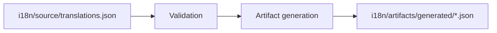
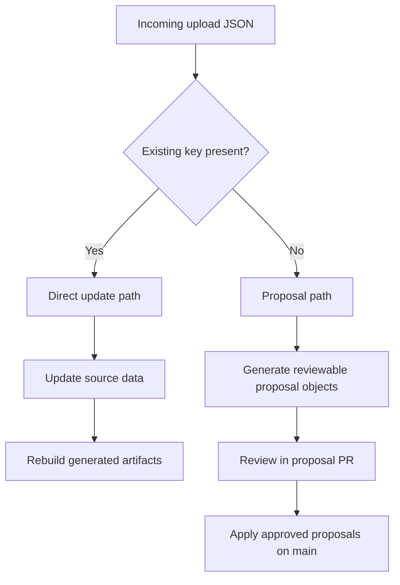
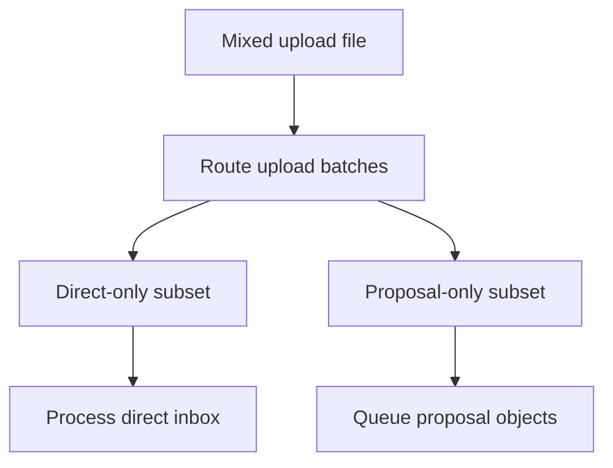

# MyPRAxIS Translation Keys

[](https://github.com/PRAxISDEVELOPMENT/mypraxis_translation_keys/actions/workflows/buildTranslations.yml)
[](https://github.com/PRAxISDEVELOPMENT/mypraxis_translation_keys/actions/workflows/processTranslationUploads.yml)
[](https://github.com/PRAxISDEVELOPMENT/mypraxis_translation_keys/actions/workflows/openTranslationProposalPr.yml)

Central repository for MyPRAxIS translation content, validation rules, generated runtime artifacts, upload processing, and proposal automation.

> [!IMPORTANT]
> The canonical source of truth is [i18n/source/translations.json](i18n/source/translations.json).
> Files under [i18n/artifacts/generated/](i18n/artifacts/generated/) are generated output and must not be edited manually.

## Overview

This repository exists to make translation changes:

- traceable
- validated
- reproducible
- safe to automate
- easy to review

It does five jobs:

1. stores the canonical translation entries
2. validates translation structure and configuration
3. generates runtime-ready locale and metadata artifacts
4. processes editor or frontend upload payloads
5. routes new keys into a reviewable proposal flow

The main operating rule is simple:

- existing keys may be updated directly
- new keys must go through the proposal path

That split keeps copy changes fast while preventing unreviewed key and namespace drift.

## Start Here

If you only need orientation, use this table first.

| I want to... | Read... |
| --- | --- |
| understand the repository quickly | [How It Works](#how-it-works) |
| find the important files and directories | [Repository Layout](#repository-layout) |
| run the right command | [Command Guide](#command-guide) |
| copy a ready-to-use client i18n setup | [Client Templates](#client-templates) |
| understand upload routing and proposal behavior | [Upload Processing](#upload-processing) |
| understand GitHub Actions automation | [Automation](#automation) |
| get deeper implementation detail | [Detailed Documentation](#detailed-documentation) |

## How It Works

The repository has one canonical source file and several derived or operational layers around it.

### 1. Canonical Source

[i18n/source/translations.json](i18n/source/translations.json) is the only authoritative translation dataset.

Each entry contains:

- a stable `key`
- locale values such as `nl`, `fr`, and `en`
- application scope
- optional metadata when applicable

Humans may edit this file directly when intentionally changing canonical content.

### 2. Validation And Build

The build system reads the canonical source, validates it against repository rules, and writes derived artifacts into [i18n/artifacts/generated/](i18n/artifacts/generated/).

Generated artifacts include:

- runtime locale trees such as [i18n/artifacts/generated/nl.json](i18n/artifacts/generated/nl.json), [i18n/artifacts/generated/fr.json](i18n/artifacts/generated/fr.json), and [i18n/artifacts/generated/en.json](i18n/artifacts/generated/en.json)
- metadata files such as [i18n/artifacts/generated/registry.json](i18n/artifacts/generated/registry.json), [i18n/artifacts/generated/summary.json](i18n/artifacts/generated/summary.json), [i18n/artifacts/generated/keys.json](i18n/artifacts/generated/keys.json), [i18n/artifacts/generated/namespaces.json](i18n/artifacts/generated/namespaces.json), and [i18n/artifacts/generated/applications.json](i18n/artifacts/generated/applications.json)

These files are deterministic output. If they differ from source, either source changed, config changed, or the build logic changed.

### 3. Upload Processing

Apps or editors can submit JSON payloads into the upload flow instead of editing the source file manually.

The upload processor classifies each entry into one of these paths:

- direct update
  Used for existing keys. Safe changes can be merged directly into `translations.json`.
- proposal
  Used for new keys. A reviewable proposal object is created and later reviewed through the proposal workflow.
- skipped
  Used when the payload does not actually change anything.
- error
  Used when the payload is structurally invalid or violates repository rules.

### 4. Proposal Review Layer

New keys are not written straight into the canonical source. They first become proposal objects in [i18n/proposals/pending/](i18n/proposals/pending/), where reviewers can inspect and edit them before merge.

After approved proposal objects are applied on `main`, they are archived into [i18n/proposals/processed/](i18n/proposals/processed/).

### 5. Operational State

Uploads themselves are workflow state, not canonical business data.

- [i18n/uploads/incoming/](i18n/uploads/incoming/) is the inbox
- [i18n/uploads/processed/](i18n/uploads/processed/) is the archive
- [i18n/artifacts/reports/](i18n/artifacts/reports/) contains processing and routing reports

## Core Rules

These are the rules that matter most when working in this repository.

- edit [i18n/source/translations.json](i18n/source/translations.json) when you want to change canonical content directly
- do not edit files in [i18n/artifacts/generated/](i18n/artifacts/generated/) by hand
- keep source, generated artifacts, and workflow state separate
- use existing keys for direct updates
- send new keys through the proposal path
- update docs when repository behavior changes

## Repository Layout

```text
i18n/
├── artifacts/
│   ├── generated/            # derived runtime and metadata files
│   └── reports/              # routing, prepare, and proposal reports
├── bin/                      # CLI entry points
├── config/                   # namespaces, applications, and schemas
├── proposals/
│   ├── pending/              # reviewable proposal objects
│   └── processed/            # archived approved proposal objects
├── source/                   # canonical translation source
├── src/
│   ├── core/                 # shared helpers
│   ├── translation-build/    # validation and artifact generation
│   └── upload-processing/    # upload analysis, routing, and proposal logic
└── uploads/
    ├── incoming/             # upload inbox
    └── processed/            # archived upload payloads

docs/                         # deeper reference guides
templates/                    # copy-ready JS and TS client i18n examples
scripts/                      # local helper scripts
.github/workflows/            # CI and automation behavior
```

## Important Files

| File or Directory | Purpose |
| --- | --- |
| [i18n/source/translations.json](i18n/source/translations.json) | canonical translation source |
| [i18n/config/namespaces.json](i18n/config/namespaces.json) | allowed namespaces and defaults |
| [i18n/config/applications.json](i18n/config/applications.json) | allowed application identifiers |
| [i18n/config/upload.schema.json](i18n/config/upload.schema.json) | upload payload contract |
| [i18n/bin/build-translations.js](i18n/bin/build-translations.js) | build and validation entry point |
| [i18n/bin/process-upload.js](i18n/bin/process-upload.js) | single upload preparation and proposal application |
| [i18n/bin/process-upload-inbox.js](i18n/bin/process-upload-inbox.js) | inbox processing for direct and proposal modes |
| [i18n/bin/route-upload-batches.js](i18n/bin/route-upload-batches.js) | mixed-batch router |
| [i18n/bin/simulate-upload.js](i18n/bin/simulate-upload.js) | local upload simulation helper |
| [i18n/src/translation-build/](i18n/src/translation-build/) | translation validation and generation logic |
| [i18n/src/upload-processing/](i18n/src/upload-processing/) | upload classification, routing, and proposal logic |
| [i18n/artifacts/reports/](i18n/artifacts/reports/) | prepare, routing, and apply reports |
| [templates/](templates/) | copy-ready JS and TS client integration examples |

## Requirements And Setup

Requirements:

- Node.js 20 or newer
- npm
- Git
- optionally `gh` for some maintainer workflows

Install dependencies:

```bash
npm install
```

Recommended first checks:

```bash
npm run tooling:check-syntax
npm run translations:check
```

## Command Guide

### Translation Build Commands

| Command | What it does |
| --- | --- |
| `npm run translations:build` | validates source and rewrites generated artifacts |
| `npm run translations:check` | fails if generated artifacts are out of sync |
| `npm run translations:report` | prints a detailed translation health report |
| `npm run translations:validate` | runs stricter validation mode |
| `npm run translations:list-namespaces` | prints configured namespaces |
| `npm run translations:help` | shows CLI help |

### Upload Commands

| Command | What it does |
| --- | --- |
| `npm run uploads:prepare -- --input <file>` | classifies one upload file into direct updates, proposals, skips, and errors |
| `npm run uploads:prepare -- --input <file> --apply-direct` | applies safe direct updates to source immediately |
| `npm run uploads:route` | splits mixed upload batches into direct-only and proposal-only subsets |
| `npm run uploads:process-inbox -- --mode direct` | processes direct-update inbox files |
| `npm run uploads:process-inbox -- --mode proposal` | turns proposal uploads into reviewable proposal object files |
| `npm run uploads:apply-proposals -- --input <report-file>` | applies proposal entries from a prepare report |
| `npm run proposals:apply-pending` | applies reviewed proposal object files from `i18n/proposals/pending/` |
| `npm run uploads:simulate -- ...` | simulates upload behavior locally |
| `npm run uploads:help` | shows upload CLI help |

### Tooling And Helper Commands

| Command | What it does |
| --- | --- |
| `npm run tooling:check-syntax` | syntax-checks the Node tooling files |
| `npm run help` | shows build help |
| `npm run update` | helper workflow that builds, commits, pushes, waits, and syncs |

## Build And Validation Flow

This is the simplest path in the repository.



Typical local workflow:

1. edit [i18n/source/translations.json](i18n/source/translations.json)
2. run `npm run translations:build`
3. inspect the generated changes
4. run `npm run translations:check`

## Client Templates

If you need to consume these translations from a web app or Expo app, use the ready-to-copy examples in [templates/](templates/).

They are aligned with the current repository output:

- they load `en`, `fr`, and `nl`
- they fetch from `i18n/artifacts/generated/{{lng}}.json`
- they keep missing translations visible as `(missing key) your.key`
- they keep `moment` synchronized with the active language

Raw GitHub URL pattern:

```text
https://raw.githubusercontent.com/PRAxISDEVELOPMENT/mypraxis_translation_keys/main/i18n/artifacts/generated/{{lng}}.json
```

Available template files:

- [templates/javascript/web/i18n.js](templates/javascript/web/i18n.js)
- [templates/javascript/expo/i18n.js](templates/javascript/expo/i18n.js)
- [templates/typescript/web/i18n.ts](templates/typescript/web/i18n.ts)
- [templates/typescript/expo/i18n.ts](templates/typescript/expo/i18n.ts)

## Upload Processing

Uploads exist so editors or applications can submit translation changes as JSON payloads.

### Upload Payload Shape

The payload contract is defined in [i18n/config/upload.schema.json](i18n/config/upload.schema.json).

Example:

```json
{
  "version": 1,
  "source": "frontend-editor",
  "entries": [
    {
      "key": "common.save",
      "nl": "Opslaan"
    },
    {
      "en": "New button",
      "nl": "Nieuwe knop"
    }
  ]
}
```

### How Entries Are Classified

#### Existing key with `key`

If an entry contains a valid existing `key`, it is treated as a direct update candidate.

Behavior:

- only the locale fields that are present are considered
- if a present locale value differs from the current source value, it becomes a direct update
- if a present locale value is an explicit empty string, that locale is cleared
- if no present locale value changes anything, the entry is marked as skipped

Example:

```json
{
  "key": "common.save",
  "fr": ""
}
```

That means: keep the same key, clear the French value.

#### Entry without `key`

If an entry has no `key`, it is treated as a proposal candidate for a new translation key.

The system then:

1. derives a suggested key and namespace
2. writes a prepare report
3. queues a reviewable proposal object instead of editing the canonical source immediately

### Upload Flow Overview



### Mixed Batch Routing

Some payloads contain both existing-key edits and new-key proposals. Those batches are split automatically.



### Reports

Processing reports are written into [i18n/artifacts/reports/](i18n/artifacts/reports/).

These reports are the first place to inspect when you need to answer questions like:

- why was this upload skipped
- why did this entry become a proposal
- which direct updates were applied
- which proposal objects were created or applied

## Automation

The repository uses GitHub Actions to keep translation workflows predictable.

### Main Workflows

| Workflow | Purpose |
| --- | --- |
| [.github/workflows/buildTranslations.yml](.github/workflows/buildTranslations.yml) | validates source and generated artifacts |
| [.github/workflows/processTranslationUploads.yml](.github/workflows/processTranslationUploads.yml) | routes and processes uploaded payloads |
| [.github/workflows/openTranslationProposalPr.yml](.github/workflows/openTranslationProposalPr.yml) | opens or updates proposal PRs |

### Branch Behavior

- pushes to `main` can process direct updates and route proposal uploads
- proposal work happens on `translation_proposals/**` branches
- approved proposal objects are later applied back onto `main`

## Common Workflows

### Update Existing Translation Content Directly

Use this when you intentionally edit the canonical source.

```bash
npm run translations:build
npm run translations:check
```

Change:

- [i18n/source/translations.json](i18n/source/translations.json)

Inspect:

- [i18n/artifacts/generated/](i18n/artifacts/generated/)

### Debug Why An Upload Did Not Change Source

Inspect in this order:

1. [i18n/artifacts/reports/](i18n/artifacts/reports/)
2. [i18n/uploads/incoming/](i18n/uploads/incoming/) or [i18n/uploads/processed/](i18n/uploads/processed/)
3. [i18n/proposals/pending/](i18n/proposals/pending/) if the upload created a new-key proposal

Most common causes:

- the payload used no `key`, so the entry became a proposal
- the payload reused an existing key but did not actually change any locale value
- the payload sent stale frontend state
- the payload violated the upload schema or repository rules

### Change Upload Logic

Start here:

- [i18n/src/upload-processing/](i18n/src/upload-processing/)
- [docs/upload-processing.md](docs/upload-processing.md)
- [.github/workflows/processTranslationUploads.yml](.github/workflows/processTranslationUploads.yml)

### Change Validation Or Artifact Generation

Start here:

- [i18n/src/translation-build/](i18n/src/translation-build/)
- [docs/architecture.md](docs/architecture.md)

## Troubleshooting

### Generated Files Changed Unexpectedly

Run:

```bash
npm run translations:build
npm run translations:check
```

Then inspect:

- [i18n/source/translations.json](i18n/source/translations.json)
- [i18n/config/](i18n/config/)
- [i18n/src/translation-build/](i18n/src/translation-build/)

### Upload Was Processed But Nothing Updated

Inspect the corresponding file in [i18n/artifacts/reports/](i18n/artifacts/reports/).

Typical explanations:

- the entry was `skipped`
- the payload created a proposal instead of a direct update
- the locale values were identical to the current source values

### New Key Did Not Appear In `translations.json`

That is usually expected. New keys are proposal candidates first, not direct writes. Check:

- [i18n/proposals/pending/](i18n/proposals/pending/)
- [i18n/proposals/processed/](i18n/proposals/processed/)
- [docs/upload-processing.md](docs/upload-processing.md)

## Detailed Documentation

The root README is the fastest orientation layer. Deeper guides live in [docs/](docs/).

| Document | Purpose |
| --- | --- |
| [CONTRIBUTING.md](CONTRIBUTING.md) | contributor onboarding and working rules |
| [docs/README.md](docs/README.md) | documentation index |
| [docs/architecture.md](docs/architecture.md) | system boundaries and ownership |
| [docs/upload-processing.md](docs/upload-processing.md) | upload routing, direct updates, proposals, and reports |
| [docs/github-automation.md](docs/github-automation.md) | GitHub Actions and proposal branch behavior |
| [docs/maintainer-workflow.md](docs/maintainer-workflow.md) | everyday maintainer workflow and troubleshooting |
| [templates/README.md](templates/README.md) | client integration templates for JS, TS, web, and Expo |

## Short Version

If you only remember one sentence, remember this:

This repository keeps one canonical translation source, validates it, derives runtime artifacts from it, and routes uploaded changes either into safe direct updates or into reviewed proposal workflows for new keys.
